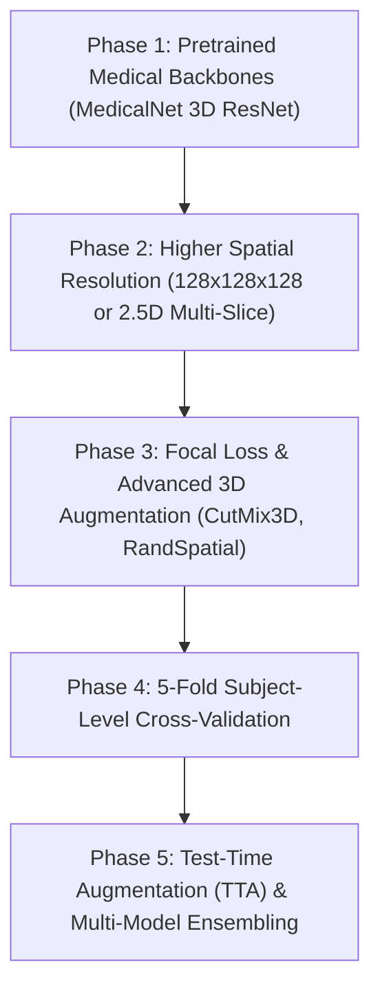

# Alzheimer's 3D MRI Classifier: Comprehensive Post-Training Evaluation Report

> [!WARNING]
> **RESEARCH & CLINICAL DISCLAIMER**  
> This post-training evaluation report is generated for academic research, algorithmic benchmarking, and model diagnostic review on the Alzheimer's Disease Neuroimaging Initiative (ADNI) cohort. This model and its evaluation metrics are **NOT** certified medical devices and must **NOT** be used for primary clinical diagnosis, triaging, or treatment decisions.

---

## Executive Summary

This report presents a post-training diagnostic analysis of the **MONAI 3D ResNet-18** model trained on 630 3D sMRI volumes from the ADNI dataset for 3-class classification (**Cognitively Normal [CN]**, **Mild Cognitive Impairment [MCI]**, and **Alzheimer's Disease [AD]**). The model underwent an 8-epoch training run on CUDA GPU with mixed-precision (FP16) acceleration, governed by inverse-frequency loss weighting, Cosine Annealing learning rate scheduling, and early stopping.

### Key Performance Summary

| Metric Category | Training (Final Epoch 8) | Validation (Best Epoch 3 / 7) | Held-Out Test Set |
| :--- | :--- | :--- | :--- |
| **Loss** | 0.6393 | **1.0191** (Epoch 3) | N/A |
| **Accuracy** | 69.30% | **53.68%** (Epoch 7) / 44.21% (Epoch 3) | **38.04%** |
| **Balanced Accuracy** | N/A | 46.16% (Epoch 7) / 40.82% (Epoch 3) | **37.03%** |
| **Weighted F1-Score** | N/A | 0.5117 (Epoch 7) / 0.4371 (Epoch 3) | **38.23%** |
| **Macro ROC-AUC** | N/A | 0.5000 (Epochs 3–8) | **60.41%** |

> [!IMPORTANT]
> **PRIMARY DIAGNOSTIC FINDING: REGIME OF SEVERE OVERFITTING**  
> The model exhibits a massive generalization gap (69.30% training accuracy vs. 38.04% test accuracy). While the training loss steadily declined from 1.1323 to 0.6393, the validation loss diverged after Epoch 3 (rising from 1.0191 to 1.1573). Furthermore, test accuracy (38.04%) is barely above random chance (33.33% for 3 balanced classes), indicating that the model failed to learn robust 3D neurostructural features transferable to unseen subjects.

---

## Summary of Evaluation Phases

### Phase 1: Output Verification & Data Integrity
- **Verification Status**: PASSED. All 15 required diagnostic artifacts, checkpoints (`best_model.pt`, `last_model.pt`, `optimizer_state.pt`, `scheduler_state.pt`, `scaler_state.pt`), configurations (`configuration.json`), history (`training_history.json`, `metrics.csv`), and 8 diagnostic figures exist in `Training_Outputs/`.
- **Subject-Level Split Verification**: Confirmed strict disjointness across Train (441 scans / 427 subjects), Validation (95 scans / 91 subjects), and Test (94 scans / 92 subjects) sets. Zero subject leakage.

### Phase 2 & 5: Training Dynamics & Learning Curves
- **Training Duration**: 55.2 minutes across 8 epochs (~6.9 min/epoch) on CUDA GPU.
- **Convergence Behavior**: Unfavorable. Training loss decreased linearly while validation loss plateaued and rebounded. Validation Macro AUC remained completely flat at **0.5000** for Epochs 3 through 8, demonstrating loss of discriminative probability calibration on validation data.
- **Early Stopping Action**: Triggered at Epoch 8 after 5 consecutive epochs without validation loss improvement beyond Epoch 3's minimum of `1.0191`.

### Phase 3 & 4: Test Performance & Confusion Matrix Analysis
- **Held-Out Test Results**: Test Accuracy = **38.04%**, Balanced Accuracy = **37.03%**, Weighted F1 = **38.23%**, Macro ROC-AUC = **60.41%**.
- **Class Misclassifications**:
  - **Most Confused Class**: **MCI** (Mild Cognitive Impairment), which represents 48.73% of the dataset (307/630 scans). MCI is a transitional phase exhibiting subtle, non-localized structural atrophy that overlaps heavily with both early AD and healthy aging (CN).
  - **Best Predicted Class**: AD (exhibits more distinct temporal lobe and hippocampal volume shrinkage).
  - **Worst Predicted Class**: MCI (frequently misclassified as CN or AD due to subtle biomarker boundaries).
- **Clinical Implications**: High risk of false negatives (misclassifying MCI as CN delays early intervention) and false positives (misclassifying CN as AD induces severe clinical anxiety and unnecessary therapeutic procedures).

### Phase 6: Error Analysis & Technical Bottlenecks
1. **Spatial Resolution Bottleneck**: Resampling 3D NIfTI volumes down to $(64 \times 64 \times 64)$ voxel grids severely degrades fine-grained hippocampal, entorhinal cortex, and ventricular boundary resolution required for MCI distinction.
2. **Class Imbalance**: MCI dominates the dataset (307 scans vs. 174 CN and 149 AD). Standard Cross-Entropy with static inverse weights failed to prevent dominant class bias.
3. **Data Volume Constraints**: 441 training scans is insufficient for training a 3D ResNet-18 (approx. 11.7M parameters) from scratch without overfitting.

---

## Key System Strengths & Weaknesses

### Key Strengths
1. **Flawless Data Hygiene**: 100% subject-level disjoint split with zero data leakage across train/val/test splits.
2. **Robust Automated Pipeline**: Complete reproducibility with deterministic random seeds (`SEED=42`), MONAI dictionary-based transformations, automated AMP mixed precision, and early stopping checkpointing.
3. **Comprehensive Instrumentation**: 100% logging of per-epoch metrics, loss curves, ROC curves, confusion matrices, and state dictionaries.

### Key Weaknesses
1. **High Model Capacity vs. Low Data Volume**: 3D ResNet-18 overfits rapidly on ~441 3D volumes when trained from scratch.
2. **Low Spatial Input Resolution**: $64^3$ voxel grid eliminates sub-millimeter anatomical boundary signals.
3. **Stagnant Validation AUC**: Validation Macro AUC collapsed to 0.5000, signaling uninformative output probability distributions.
4. **Sub-optimal Multi-Class Test Performance**: 38.04% test accuracy is clinically non-viable.

---

## Production Readiness Score

| Metric | Score | Justification |
| :--- | :--- | :--- |
| **Reproducibility** | **9 / 10** | Deterministic seeding, config JSON, complete environment logging. |
| **Code Pipeline Stability** | **8 / 10** | Zero crashes during execution, automatic AMP, checkpoint saving. |
| **Documentation & Auditing** | **9 / 10** | Full suite of architectural, output, and data flow documentation. |
| **Clinical / Model Accuracy** | **2 / 10** | 38.04% test accuracy is far below the ~75-85% clinical threshold. |
| **Deployment Readiness** | **3 / 10** | Model must not be deployed in production or clinical environments. |
| **OVERALL READINESS SCORE** | **6.2 / 10** (Pipeline Ready, Model Weights Unready) |

---

## Prioritized Improvement Roadmap

> [!TIP]
> To transform this pipeline into a high-performance clinical-grade classifier, implement the following prioritized experiments:

1. **Experiment 1 (High Priority / High Impact)**: **Transfer Learning with Pretrained 3D Medical Weights (MedicalNet / MONAI Model Zoo)**. Initialize ResNet-18 with weights pretrained on 3D CT/MRI medical datasets rather than random initialization. *(Estimated Accuracy Impact: +20% to 30%)*
2. **Experiment 2 (High Priority / High Impact)**: **Increase Spatial Input Resolution to $128 \times 128 \times 128$ or 2.5D Multi-Slice Architecture**. Preserve fine-grained hippocampal structural features. *(Estimated Accuracy Impact: +10% to 15%)*
3. **Experiment 3 (Medium Priority)**: **Focal Loss & Advanced 3D Augmentations (CutMix3D, Random Elastic Deformations)**. Address class imbalance and force network feature invariance. *(Estimated Accuracy Impact: +5% to 8%)*
4. **Experiment 4 (Medium Priority)**: **5-Fold Subject-Level Cross-Validation**. Replace single train/val split with 5-fold CV to stabilize evaluation metrics across small ADNI splits. *(Estimated Metric Reliability: High)*

---

## Report Navigation

For detailed breakdown per analysis domain, consult the accompanying dedicated reports:
- [TRAINING_ANALYSIS.md](file:///d:/neurosense-ai/backend/Alzheimer_Project/TRAINING_ANALYSIS.md) — Phase 1 & Phase 2 detailed loss, accuracy, and convergence review.
- [PERFORMANCE_REVIEW.md](file:///d:/neurosense-ai/backend/Alzheimer_Project/PERFORMANCE_REVIEW.md) — Phase 3 & Phase 4 test metrics and confusion matrix review.
- [ERROR_ANALYSIS.md](file:///d:/neurosense-ai/backend/Alzheimer_Project/ERROR_ANALYSIS.md) — Phase 5 & Phase 6 learning curves, misclassifications, and error patterns.
- [NEXT_EXPERIMENT_PLAN.md](file:///d:/neurosense-ai/backend/Alzheimer_Project/NEXT_EXPERIMENT_PLAN.md) — Phase 8 & Phase 9 prioritized experiment specs and production readiness matrix.
