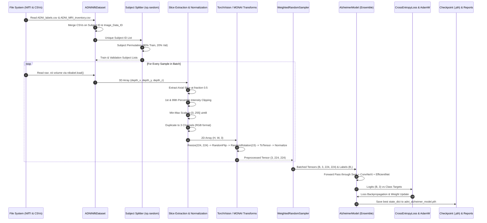

# NeuroSense AI — ADNI Alzheimer's Data Flow & Processing Pipeline

## Overview
This document details the end-to-end data processing lifecycle of the ADNI MRI Classification pipeline, tracing data transformations from raw 3D Structural Magnetic Resonance Imaging (sMRI) NIfTI volumes to metadata reconciliation, 2D slice extraction, intensity clipping, MONAI/TorchVision transformations, batching, weighted sampling, neural network forward pass, loss calculation, and model output serialization.

---

## Complete Data Flow Lifecycle Diagram



---

## Detailed Data Pipeline Phases

### Phase 1: Metadata Resolution & Merging
1. **Metadata Loading**: `pd.read_csv()` reads `ADNI_labels.csv` and `ADNI_MRI_inventory.csv`. Column headers are standardized by replacing spaces with underscores.
2. **Table Reconciliation**:
   - If `Group` and `MRI_Path` exist in inventory, inventory is used directly.
   - Otherwise, inventory is inner-joined with labels on `Subject` and `Image_Data_ID`.
3. **Filtering**: Non-standard diagnostic groups are removed, keeping only valid classes: `CN` (0), `MCI` (1), and `AD` (2).

### Phase 2: Subject-Level Stratified Dataset Splitting
To prevent data leakage caused by multiple longitudinal scans from the same patient appearing in both training and validation sets, subject-level partitioning is strictly enforced:
```python
all_subjects = np.array(full_ds.get_subjects())
np.random.seed(42)
shuffled_subjects = np.random.permutation(all_subjects)
split_idx = int(len(shuffled_subjects) * train_ratio)
train_subjects = shuffled_subjects[:split_idx].tolist()
val_subjects = shuffled_subjects[split_idx:].tolist()
```
- **Train Split**: 80% of unique subjects.
- **Validation Split**: 20% of unique subjects.
- **Mathematical Overlap**: `set(train_subjects) ∩ set(val_subjects) = ∅` (0% subject leakage).

### Phase 3: Volume Loading & Slice Extraction
1. **NIfTI I/O**: `nibabel.load(file_path)` reads the 3D volume header and voxel matrix (`get_fdata()`).
2. **Slice Indexing**: Based on `slice_plane` ('axial', 'coronal', 'sagittal') and `slice_fraction` (default 0.5):
   - `axial`: `z_idx = int(depth_z * 0.5)` $\rightarrow$ Slice = `volume[:, :, z_idx]`
   - `coronal`: `y_idx = int(depth_y * 0.5)` $\rightarrow$ Slice = `volume[:, y_idx, :]`
   - `sagittal`: `x_idx = int(depth_x * 0.5)` $\rightarrow$ Slice = `volume[x_idx, :, :]`
3. **Intensity Percentile Normalization**:
   To eliminate hyper-intense skull artifacts and extreme outliers:
   $$P_1 = \text{percentile}(slice, 1), \quad P_{99} = \text{percentile}(slice, 99)$$
   $$\text{clipped\_slice} = \text{clip}(slice, P_1, P_{99})$$
   $$\text{scaled\_slice} = \frac{\text{clipped\_slice} - P_1}{P_{99} - P_1} \times 255.0$$
4. **Channel Duplication**: The 2D grayscale matrix `(H, W)` is stacked 3 times into `(H, W, 3)` to make it compatible with standard PyTorch 2D image backbones.

### Phase 4: Image Transforms & Augmentation
**Training Pipeline Transforms**:
- `Resize((224, 224))`: Standardizes spatial dimensions.
- `RandomHorizontalFlip(p=0.5)`: Data augmentation for anatomical variation.
- `RandomRotation(degrees=15)`: Data augmentation for head position alignment variation.
- `ToTensor()`: Converts PIL Image to PyTorch Tensor `(3, 224, 224)` scaled to `[0.0, 1.0]`.
- `Normalize(mean=[0.2682, 0.2682, 0.2682], std=[0.3008, 0.3008, 0.3008])`: Standardizes voxel intensity statistics based on ADNI dataset channel means and standard deviations.

**Validation Pipeline Transforms**:
- `Resize((224, 224))` $\rightarrow$ `ToTensor()` $\rightarrow$ `Normalize(mean, std)`. (No random flips or rotations).

### Phase 5: Class Re-Balancing & Weighted Sampling
The ADNI dataset exhibits class imbalance (e.g. MCI and CN samples outnumber AD). To address this during training:
1. Target array extracted: `targets = train_dataset.get_targets()`.
2. Class frequencies calculated: $C = \text{bincount}(targets)$.
3. Reciprocal class weights calculated:
   $$W_c = \frac{1.0}{\max(C_c, 1)}$$
4. Sample weights assigned: $w_i = W_{targets[i]}$.
5. `WeightedRandomSampler(weights=sample_weights, num_samples=len(sample_weights), replacement=True)` passes re-weighted indices to the `DataLoader`.

### Phase 6: Model Forward Pass & Loss Backpropagation
1. DataLoader yields batch tensor $X \in \mathbb{R}^{B \times 3 \times 224 \times 224}$ and targets $y \in \{0, 1, 2\}^B$.
2. Model calculates logits: $\hat{y} = \text{AlzheimerModel}(X)$.
3. Loss function evaluates error:
   $$\mathcal{L} = \text{CrossEntropyLoss}(\hat{y}, y) = -\frac{1}{B} \sum_{i=1}^B \log \left( \frac{\exp(\hat{y}_{i, y_i})}{\sum_{j=0}^2 \exp(\hat{y}_{i, j})} \right)$$
4. AdamW optimizer updates weights: $\theta \leftarrow \theta - \eta \cdot \nabla_\theta \mathcal{L} - \lambda \theta$.
