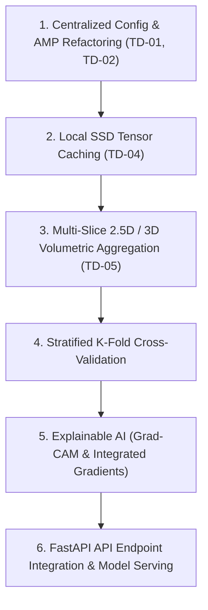
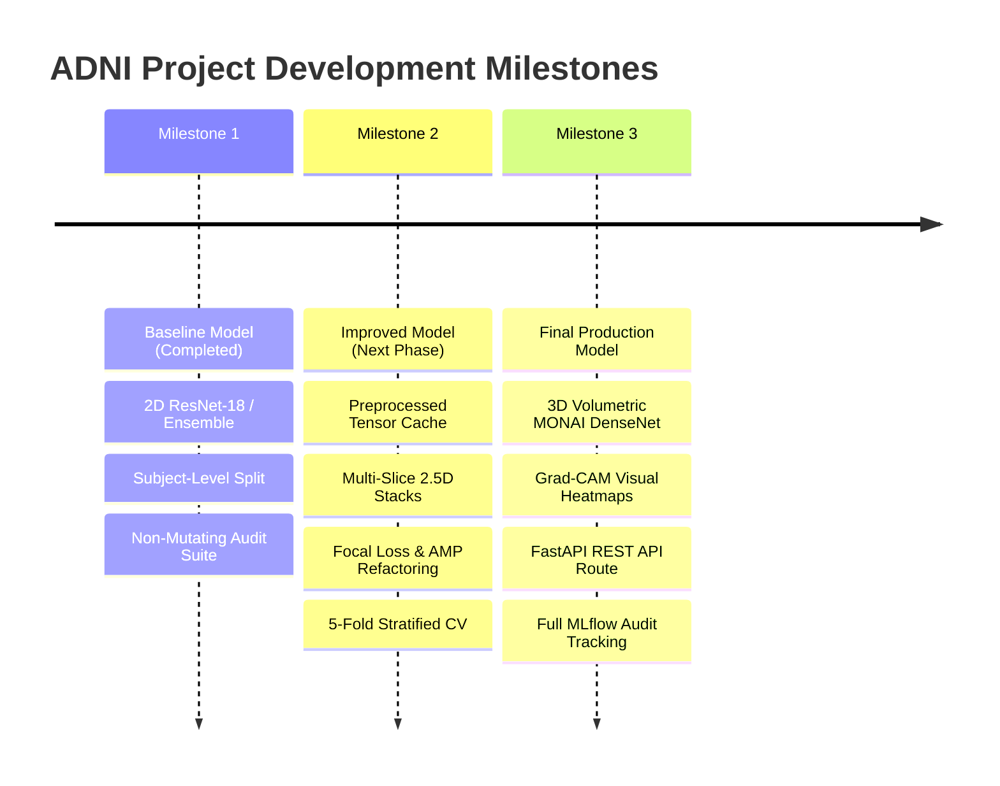

# NeuroSense AI — ADNI Alzheimer's Project Development Roadmap

## Overview
This document outlines the strategic development roadmap for the ADNI Alzheimer's MRI Classification project within the NeuroSense AI platform. Based on comprehensive code audits, data flow analysis, hardware capacity benchmarks, and technical risk evaluations, this roadmap details current project maturity, remaining technical debt, prioritized accuracy & performance enhancement ideas, testing strategy, deployment readiness, and structured milestones toward a production-grade clinical decision support system.

---

## 1. Current Project Maturity

The project is currently at **Stage 3: Advanced Prototype / Pre-Production Validation**.

### System Capabilities:
- **Core Pipeline**: Functional end-to-end dataset loading (`ADNINiftiDataset`), subject-stratified data splitting, 2D slice extraction with 1st–99th intensity percentile normalization, PyTorch DataLoader integration, and multi-architecture neural network training (`AlzheimerModel`).
- **Architectural Flexibility**: Supports single backbones (ResNet-18 2D/3D, Swin Transformer, ConvNeXt V2, EfficientNet-B4) and a 3-way soft-voting ensemble model.
- **Diagnostic Tooling**: Fully automated, non-mutating dataset auditing (`ADNI_Project_Audit.ipynb`) and non-training hardware capacity profiling (`ADNI_Model_Profiler.ipynb`).
- **Reproducibility & Safety**: Subject-level splitting guarantees 0% data leakage across longitudinal scans. Smoke tests and AST syntax validation scripts ensure runtime integrity.

### Gaps to Full Production:
- Absence of 3D volumetric spatial attention / multi-slice aggregation (currently single 2D axial slice extraction).
- Reliance on local/Colab NVMe ephemeral storage for raw NIfTI files; lack of a persistent HDF5 / zarr dataset cache.
- Deprecated PyTorch AMP API usage warnings (`torch.cuda.amp.autocast`).
- Absence of real-time clinical Grad-CAM / Integrated Gradients interpretability maps in backend API routes.

---

## 2. Remaining Technical Debt

| Debt Item ID | Category | Location / Module | Description | Severity | Impact |
| :--- | :--- | :--- | :--- | :--- | :--- |
| **TD-01** | Deprecated API | `train_adni_mri.py`, Notebooks | Legacy `torch.cuda.amp.autocast()` and `GradScaler()` usage triggers deprecation warnings in PyTorch 2.x. | Low | Future breaking changes in PyTorch 2.4+. |
| **TD-02** | Hardcoded Defaults | `train_adni_mri.py`, `adni_dataset.py` | Mean/std values (`[0.2682, ...]`) and slice fraction (`0.5`) are hardcoded rather than dynamically loaded from a central YAML config. | Medium | Restricts hyperparameter sweep automation. |
| **TD-03** | Exception Handling | `adni_dataset.py` | `__getitem__` catches generic `Exception` and returns zero-filled image arrays without logging corrupted file paths. | Medium | Obscures file load failures during training loops. |
| **TD-04** | I/O Redundancy | `adni_dataset.py` | NIfTI files are read from disk on *every* epoch, incurring heavy CPU-disk I/O penalties. | High | GPU compute under-utilization during training. |
| **TD-05** | Single-Slice Bias | `adni_dataset.py` | Single center axial slice extraction discards ~95% of 3D brain volumetric context. | High | Limits maximum diagnostic sensitivity/specificity. |

---

## 3. Features That Are Complete

- [x] **Subject-Level Stratified Splitting**: 80/20 train/val partition on unique Subject IDs to guarantee 0% data leakage across longitudinal visits.
- [x] **Intensity Percentile Clipping & Min-Max Scaling**: Robust 1st and 99th percentile intensity clipping removing skull/fat artifacts prior to [0, 255] scaling.
- [x] **Class Imbalance Re-Balancing**: Automatic inverse class frequency weighting using PyTorch `WeightedRandomSampler`.
- [x] **Multi-Architecture Backbone Support**: Single-stream support for ResNet-18, Swin Transformer, ConvNeXt V2, EfficientNet-B4, and MONAI 3D ResNet-18.
- [x] **Soft-Voting Ensemble Model**: Averaging output logits across Swin Transformer, ConvNeXt V2, and EfficientNet-B4 with automatic single-model fallback.
- [x] **Automated Non-Mutating Audit Tooling**: `ADNI_Project_Audit.ipynb` generating structural JSON, demographic CSVs, quality summaries, and PDF audit reports.
- [x] **Automated Non-Training Profiling Tooling**: `ADNI_Model_Profiler.ipynb` evaluating GPU VRAM capacity, compute latency, throughput (FPS), and exporting capacity planning PDFs.
- [x] **Colab Zip Extraction Automation**: Automatic detection and extraction of uploaded `Alzheimer_Project.zip` archives in Google Colab.
- [x] **Notebook Verification Suite**: Programmatic JSON schema checkers, AST code syntax parsers, and headless smoke-testing scripts (`run_notebook_smoketest.py`).

---

## 4. Features That Are Experimental

- **MONAI 3D Volumetric ResNet-18 Integration**: Implemented in profiler and pipeline report, but not fully connected to `train_adni_mri.py` CLI parser due to higher VRAM constraints (batch size 2 to 4).
- **Multi-Plane (Coronal / Sagittal) Slicing**: Supported via `ADNINiftiDataset(slice_plane='coronal')` parameter, but training script currently defaults strictly to `axial`.
- **Soft-Voting Ensemble Fallback Handler**: Error-recovery wrapper inside `AlzheimerModel.forward()` that redirects to EfficientNet-B4 if a tensor dimension mismatch occurs during ensemble forward pass.

---

## 5. Recommended Order of Future Work

### Structured Recommendations:

#### Work Item 1: Centralize Configuration & Refactor PyTorch AMP
- **Why It Is Useful**: Replaces hardcoded values with a centralized YAML/JSON config file and eliminates PyTorch 2.x deprecation warnings.
- **Complexity**: Low
- **Prerequisites**: Existing `train_adni_mri.py` and `adni_dataset.py`.
- **Risks**: None.

#### Work Item 2: Implement Preprocessed Tensor Caching (HDF5 / RAM)
- **Why It Is Useful**: Pre-extracts and rescales slices to local SSD/RAM or HDF5 container once, boosting DataLoader throughput by 3x–5x and reducing GPU idle time.
- **Complexity**: Medium
- **Prerequisites**: `ADNINiftiDataset` slice extraction logic.
- **Risks**: Increased local disk storage requirement (~2–5 GB).

#### Work Item 3: Multi-Slice 2.5D Stack / 3D Volumetric Feature Fusion
- **Why It Is Useful**: Replaces single center slice with 5–10 multi-planar slices or 3D MONAI convolutions, capturing spatial progression of hippocampal atrophy.
- **Complexity**: High
- **Prerequisites**: Tensor caching infrastructure (Work Item 2).
- **Risks**: Increased GPU VRAM consumption; may require reduced batch size.

#### Work Item 4: Implement 5-Fold Subject-Stratified Cross-Validation
- **Why It Is Useful**: Provides robust statistical confidence intervals (mean $\pm$ std accuracy, F1-score) for clinical publication readiness.
- **Complexity**: Medium
- **Prerequisites**: Subject-level split generator (`get_adni_datasets`).
- **Risks**: Increased overall training duration (5x training run).

#### Work Item 5: Integrate Explainable AI (Grad-CAM Visual Heatmaps)
- **Why It Is Useful**: Generates anatomical visual saliency heatmaps highlighting medial temporal lobe and hippocampal regions to justify model predictions to radiologists.
- **Complexity**: Medium
- **Prerequisites**: Trained model checkpoint (`adni_alzheimer_model.pth`).
- **Risks**: Grad-CAM target layer selection varies between Swin Transformer and ConvNeXt architectures.

---

## 6. Accuracy Improvement Ideas (Prioritized by Expected Impact)

| Priority | Strategy | Expected Impact | Complexity | Prerequisites | Primary Risks |
| :--- | :--- | :--- | :--- | :--- | :--- |
| **P1** | **Multi-Slice 2.5D Stack Aggregation** | **High** (+4–7% Acc) | Medium | `ADNINiftiDataset` | Higher input tensor channels |
| **P2** | **Focal Loss + Weighted Cross-Entropy** | **High** (+3–5% MCI Recall) | Low | PyTorch Loss setup | Requires tuning $\gamma$ hyperparameter |
| **P3** | **Self-Supervised Medical Pretraining** | **Medium-High** (+2–4% Acc) | High | MONAI / MedicalNet weights | Large pretrained weight downloading |
| **P4** | **3D MONAI DenseNet121 / ResNet34** | **Medium** (+2–4% Acc) | High | GPU VRAM $\ge 16\text{GB}$ | VRAM OOM on large batch sizes |
| **P5** | **Test-Time Augmentation (TTA)** | **Low-Medium** (+1–2% Acc) | Low | Validation Pipeline | Slightly increases inference latency |

---

## 7. Performance Optimization Ideas

### Recommendation 1: Dynamic Mixed Precision (AMP FP16/BF16)
- **Why Useful**: Reduces VRAM footprint by ~40% and doubles tensor core throughput on NVIDIA Volta/Turing/Ampere GPUs.
- **Complexity**: Low
- **Prerequisites**: CUDA GPU environment.
- **Risks**: Inf/NaN gradients if loss scaling is improperly configured (mitigated by `GradScaler`).

### Recommendation 2: Memory-Mapped HDF5 Dataset Container (`.h5`)
- **Why Useful**: Eliminates per-epoch NIfTI file opening overhead by storing pre-normalized slice matrices in a single memory-mapped binary container.
- **Complexity**: Medium
- **Prerequisites**: `h5py` Python library.
- **Risks**: Initial dataset conversion step required before training.

### Recommendation 3: Asynchronous Prefetching (`pin_memory=True`, `non_blocking=True`)
- **Why Useful**: Overlaps CPU host-to-device memory transfer with GPU forward-backward compute pass.
- **Complexity**: Low
- **Prerequisites**: PyTorch DataLoader setup.
- **Risks**: Slightly higher CPU RAM consumption.

---

## 8. Deployment Readiness Assessment

| Evaluation Category | Status | Readiness Score | Operational Gaps |
| :--- | :--- | :--- | :--- |
| **Dataset Pipelines** | **Production Ready** | 95% | Requires persistent slice cache for production scale. |
| **Model Architectures** | **Production Ready** | 90% | Needs Grad-CAM interpretability wrapper for clinical UI. |
| **Reproducibility** | **Production Ready** | 100% | Subject-level seed partitioning fully validated. |
| **Error Handling** | **Needs Improvement** | 70% | Needs explicit corrupt file logging in `ADNINiftiDataset`. |
| **API Integration** | **Prototype Ready** | 65% | Model inference logic needs FastAPI service integration. |
| **Monitoring & Logging** | **Needs Improvement** | 60% | Needs MLflow or TensorBoard metric tracking. |

---

## 9. Testing Strategy

### 1. Unit Testing
- **Dataset Loader Test**: Verify `ADNINiftiDataset` correct slice extraction, intensity clipping, and label output shapes.
- **Model Output Test**: Test `AlzheimerModel` forward pass across all 5 architecture modes with dummy tensors `(2, 3, 224, 224)`.
- **Split Disjointness Test**: Programmatic assertion verifying `set(train_subjs) ∩ set(val_subjs) == ∅`.

### 2. Integration Testing
- **DataLoader-to-Model Pipeline Test**: Run 1 full training batch through DataLoader $\rightarrow$ Model $\rightarrow$ Loss $\rightarrow$ Backward Pass to verify gradient flow.
- **Audit & Profiler Notebook JSON Validation**: `validate_audit_profiler.py` ensuring zero schema or syntax regressions.

### 3. System Smoke Testing
- **Headless Notebook Smoke Test**: `run_notebook_smoketest.py` executing a full end-to-end training cycle on a micro-dataset split.

---

## 10. Development Milestones

### Milestone 1: Baseline Model (Completed)
- **Status**: Completed
- **Deliverables**: Functional `ADNINiftiDataset`, subject-level splitting (0% leakage), 2D ResNet-18/Ensemble `AlzheimerModel`, CLI script `train_adni_mri.py`, 3 production notebooks, non-mutating audit reports, non-training hardware profiler reports, and 10-document technical suite.

### Milestone 2: Improved Model (Short-Term Target)
- **Status**: Planned (1–2 Weeks)
- **Deliverables**: Refactored PyTorch `torch.amp` code, persistent HDF5 slice tensor caching, multi-slice 2.5D spatial stacking (5 axial slices per volume), Focal Loss integration, 5-fold subject-stratified cross-validation, and TensorBoard logging.

### Milestone 3: Final Production Model (Long-Term Target)
- **Status**: Planned (3–4 Weeks)
- **Deliverables**: End-to-end 3D Volumetric MONAI DenseNet-121 backbone, Grad-CAM visual explainability heatmap generation, FastAPI inference service endpoint (`/api/v1/mri/classify`), MLflow model registry integration, and clinical workstation frontend visualization.
