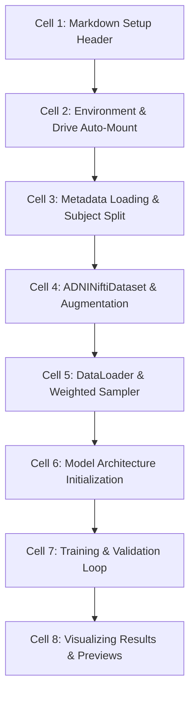

# NeuroSense AI — ADNI Alzheimer's Notebook Documentation

## Overview
The project contains three production Jupyter Notebooks located in `backend/Alzheimer_Project/Notebooks/`:
1. `ADNI_MRI_Classifier_Training.ipynb`: End-to-end model training, validation, and visual evaluation pipeline.
2. `ADNI_Project_Audit.ipynb`: Non-mutating dataset, structural integrity, and Subject leakage audit tool.
3. `ADNI_Model_Profiler.ipynb`: Non-training hardware compute benchmark and model latency profiler.

---

## 1. `ADNI_MRI_Classifier_Training.ipynb`

### Objective
Trains, validates, and evaluates deep learning classification models on the ADNI dataset, saving performance checkpoints and visual inspection figures.

### Structure & Code Cell Breakdown

#### Detailed Cell Descriptions:
- **Cell 1 (Markdown)**: Overview of training goals, environment expectations, and output directory targets.
- **Cell 2 (Code - Environment Setup)**:
  - Detects Google Colab vs Local execution environment.
  - Automatically installs missing PyTorch/MONAI/timm/nibabel packages if needed.
  - Mounts Google Drive (`/content/drive`) if running in Colab.
  - Automates search for uploaded dataset archives (`Alzheimer_Project.zip`, `ADNI.zip`, `Dataset.zip`) and extracts them to `/content/Alzheimer_Project`.
- **Cell 3 (Code - Metadata Resolution & Splitting)**:
  - Locates `ADNI_labels.csv` and `ADNI_MRI_inventory.csv`.
  - Merges records and extracts unique Subject IDs.
  - Executes random seed-based subject splitting (80% train, 20% val).
- **Cell 4 (Code - Dataset Definition & Transforms)**:
  - Defines slice extraction parameters (axial plane, middle slice fraction `0.5`).
  - Sets up image augmentation pipelines (Resize 224x224, Random Horizontal Flip, Random 15-degree Rotation, Normalization).
- **Cell 5 (Code - DataLoader & Weighted Sampler)**:
  - Computes class counts (`CN`, `MCI`, `AD`).
  - Instantiates `WeightedRandomSampler` to re-balance class distribution.
  - Constructs PyTorch DataLoader instances.
- **Cell 6 (Code - Model Architecture Setup)**:
  - Instantiates `AlzheimerModel(num_classes=3, architecture='ensemble')`.
  - Configures CrossEntropyLoss and AdamW optimizer (`lr=1e-4, weight_decay=1e-2`).
- **Cell 7 (Code - Training Loop)**:
  - Iterates over specified epochs (default 5 to 15).
  - Computes training loss and accuracy per step.
  - Evaluates validation accuracy after each epoch.
  - Saves top-performing model weights to `Models/adni_alzheimer_model.pth`.
- **Cell 8 (Code - Previews & Report Export)**:
  - Generates grid preview of sample MRI slices (`sample_mri_previews.png`).
  - Saves training summary metrics to JSON.

---

## 2. `ADNI_Project_Audit.ipynb`

### Objective
Executes a comprehensive, non-destructive audit of the ADNI MRI dataset, file system tree, structural NIfTI headers, subject leakage, background voxel ratio, and MONAI DataLoader compatibility.

### Structure & Code Cell Breakdown
- **Cell 1 (Markdown)**: Audit scope and non-mutating guarantee notice.
- **Cell 2 (Code - Setup & Output Directory)**: Configures `ADNI_Audit_Outputs/` directory and installs diagnostic dependencies.
- **Cell 3 (Code - File Tree & Asset Discovery)**:
  - Scans project directory recursively.
  - Builds inventory of `.py` modules, `.ipynb` notebooks, metadata CSVs, and `.pth` weight files.
  - Exports result to `project_audit.json`.
- **Cell 4 (Code - NIfTI Header & Subject Leakage Audit)**:
  - Loads all `.nii` and `.nii.gz` files using `nibabel`.
  - Audits matrix shapes, voxel zoom spacing, and RAS orientation codes.
  - Performs mathematical set intersection on train/val/test subject IDs to verify 0% leakage (`assert not has_leakage`).
  - Exports demographic breakdown to `dataset_statistics.csv`.
- **Cell 5 (Code - Medical Imaging Quality Inspection)**:
  - Samples 30 NIfTI volumes to compute minimum/maximum intensities, 1st and 99th percentiles, zero-voxel background percentage, and blank axial slice count.
  - Exports quality breakdown to `quality_summary.csv`.
- **Cell 6 (Code - Data Pipeline Sanity Test)**:
  - Builds MONAI pre-processing pipeline (`LoadImaged`, `EnsureChannelFirstd`, `Orientationd`, `Spacingd`, `ScaleIntensityRangePercentilesd`, `ResizeWithPadOrCropd`).
  - Passes mock batch to test for NaNs or Infs.
  - Exports result to `pipeline_report.json`.
- **Cell 7 (Code - PDF Summary Report Generation)**:
  - Generates single-page PDF report (`audit_summary.pdf`).

---

## 3. `ADNI_Model_Profiler.ipynb`

### Objective
Evaluates compute hardware environment, GPU VRAM capacity, model parameters, latency (ms/batch), throughput (FPS), and produces capacity planning recommendations without running training loops.

### Structure & Code Cell Breakdown
- **Cell 1 (Markdown)**: Hardware profiler scope and objectives.
- **Cell 2 (Code - Hardware Discovery)**:
  - Profiles system RAM, CPU logical cores, CUDA availability, GPU model, total VRAM, and installed PyTorch/MONAI/timm versions.
  - Exports hardware specs to `hardware_report.json`.
- **Cell 3 (Code - Model Architecture Latency Benchmarking)**:
  - Profiles 3D MONAI ResNet-18, 2D TorchVision ResNet-18, and timm EfficientNet-B4.
  - Measures trainable parameters, weight size in MB, forward pass latency in ms, and throughput in FPS.
  - Exports benchmark metrics to `model_report.json`.
- **Cell 4 (Code - Training Readiness & Capacity Calculations)**:
  - Calculates recommended batch size based on available VRAM (e.g. VRAM >= 12GB $\rightarrow$ batch size 32 for 2D, 4 for 3D).
  - Calculates recommended DataLoader worker thread count (`num_workers = min(4, cpu_count - 1)`).
  - Identifies bottlenecks (Disk I/O from Google Drive, CPU fallback thread contention).
  - Exports training recommendations to `training_readiness.json`.
- **Cell 5 (Code - Profiler PDF Generation)**:
  - Generates executive PDF report (`profiler_summary.pdf`).
