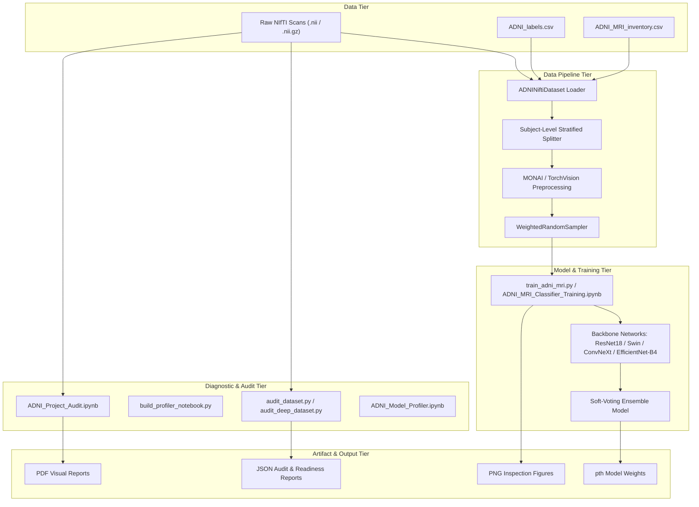
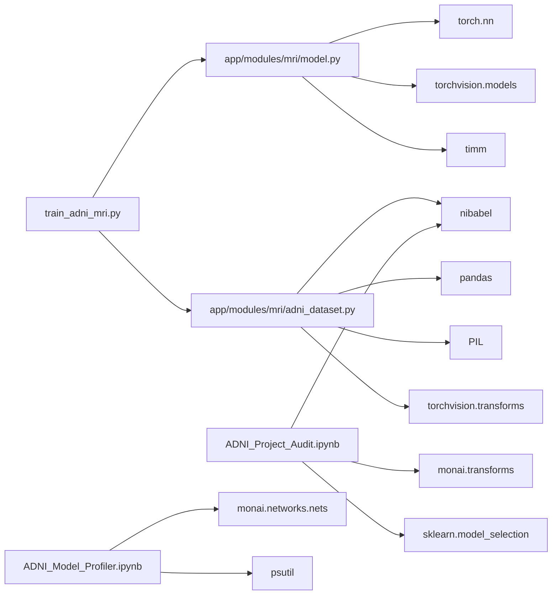

# NeuroSense AI — ADNI Alzheimer's MRI Classification Project Architecture

## Executive Overview
The ADNI Alzheimer's MRI Classification project is a specialized medical imaging deep learning pipeline integrated into the NeuroSense AI platform. The system processes 3D Structural Magnetic Resonance Imaging (sMRI) volumes from the Alzheimer's Disease Neuroimaging Initiative (ADNI) cohort to perform tri-class diagnostic classification:
- **CN**: Cognitively Normal
- **MCI**: Mild Cognitive Impairment
- **AD**: Alzheimer's Disease

The pipeline combines non-destructive dataset auditing, multi-model execution profiling, subject-stratified longitudinal data loading, and deep neural network training across PyTorch, MONAI, and timm architectures.

---

## High-Level Architecture Diagram

---

## System Component Breakdown

### 1. Backend Core Integration
- **`app.modules.mri.adni_dataset.ADNINiftiDataset`**: Main dataset module. Reads metadata CSVs, resolves raw NIfTI file paths on disk, extracts slice orientations (axial, coronal, sagittal), performs 1st–99th percentile intensity clipping, and applies PyTorch transforms.
- **`app.modules.mri.model.AlzheimerModel`**: Model architecture module supporting ResNet-18 (2D), Swin Transformer, ConvNeXt V2, EfficientNet-B4, and a 3-way soft-voting ensemble.

### 2. Standalone Training Pipeline
- **`train_adni_mri.py`**: CLI entry point for model training. Implements subject-level splitting (80/20 train/val), class weight calculation via `WeightedRandomSampler`, cross-entropy loss optimization using AdamW, validation accuracy tracking, and automatic checkpointing to `Models/adni_alzheimer_model.pth`.
- **`ADNI_MRI_Classifier_Training.ipynb`**: Interactive notebook version of the training pipeline, optimized for Google Colab and local execution with dynamic drive detection and real-time figure visualization.

### 3. Non-Mutating Audit & Quality Assurance Tier
- **`ADNI_Project_Audit.ipynb` & `build_audit_notebook.py`**: Non-destructive diagnostic auditing notebook and builder script. Performs file discovery, verifies NIfTI structural headers, validates subject disjointness (0% data leakage), measures background voxel ratios, checks for blank slices, and exports structured reports.
- **`audit_dataset.py` & `audit_deep_dataset.py`**: CLI tools for demographic breakdowns (age, sex distributions per class) and statistical spatial inspection.

### 4. Hardware Profiler & Capacity Planning Tier
- **`ADNI_Model_Profiler.ipynb` & `build_profiler_notebook.py`**: Hardware profiling notebook and builder script. Benchmarks GPU VRAM capacity, CPU thread availability, PyTorch/MONAI/timm versions, model latency (ms/batch), throughput (FPS), parameter count, and calculates optimal batch sizes and worker thread counts.

---

## Dependency Graph & Module Relationships

---

## Execution Flow

1. **Environment Setup & Dataset Resolution**:
   - The system checks local or Google Colab environments.
   - If in Colab, checks for `Alzheimer_Project.zip` and extracts it to `/content/`.
   - Locates `Metadata/ADNI_labels.csv` and `Metadata/ADNI_MRI_inventory.csv`.

2. **Non-Mutating Audit & Profiling (Optional Diagnostics)**:
   - `ADNI_Project_Audit.ipynb` generates `ADNI_Audit_Outputs/project_audit.json`, `dataset_statistics.csv`, `quality_summary.csv`, and `audit_summary.pdf`.
   - `ADNI_Model_Profiler.ipynb` generates `ADNI_Profiler_Outputs/hardware_report.json`, `model_report.json`, `training_readiness.json`, and `profiler_summary.pdf`.

3. **Data Loading & Splitting**:
   - `ADNINiftiDataset` reads metadata CSVs and merges them on `Subject` and `Image_Data_ID`.
   - `get_adni_datasets()` performs random permutation on unique subject IDs (80% train, 20% val) to guarantee zero subject overlap between splits.
   - Computes class counts and initialises `WeightedRandomSampler` to re-balance CN, MCI, and AD classes.

4. **Model Initialization & Training Loop**:
   - `AlzheimerModel` initializes the selected architecture (`ensemble` default).
   - Images are loaded, 2D slices extracted, normalized, and transformed into 3-channel tensors `(B, 3, 224, 224)`.
   - Model outputs logits, AdamW optimizer updates parameters based on `CrossEntropyLoss`.
   - Epoch accuracy is evaluated on the validation set. If validation accuracy improves, checkpoint weights are saved to `Models/adni_alzheimer_model.pth`.

---

## Key Input & Output Artifacts

| Category | Path | Description |
| :--- | :--- | :--- |
| **Input Data** | `Dataset/ADNI/*/*/*.nii` | 3D Structural MRI files in NIfTI format |
| **Metadata** | `Metadata/ADNI_labels.csv` | Master subject labels, diagnostic groups (CN/MCI/AD), age, sex |
| **Metadata** | `Metadata/ADNI_MRI_inventory.csv` | File paths and image data IDs for MRI scans |
| **Output Model** | `Models/adni_alzheimer_model.pth` | Saved PyTorch model state dictionary |
| **Audit Report** | `ADNI_Audit_Outputs/project_audit.json` | Structure audit, discovered files, missing assets |
| **Audit Report** | `ADNI_Audit_Outputs/pipeline_report.json` | DataLoader verification report |
| **Profiler Report**| `ADNI_Profiler_Outputs/hardware_report.json` | PyTorch, MONAI, CUDA, and hardware specs |
| **Profiler Report**| `ADNI_Profiler_Outputs/training_readiness.json` | Bottlenecks, recommended batch size, worker counts |
