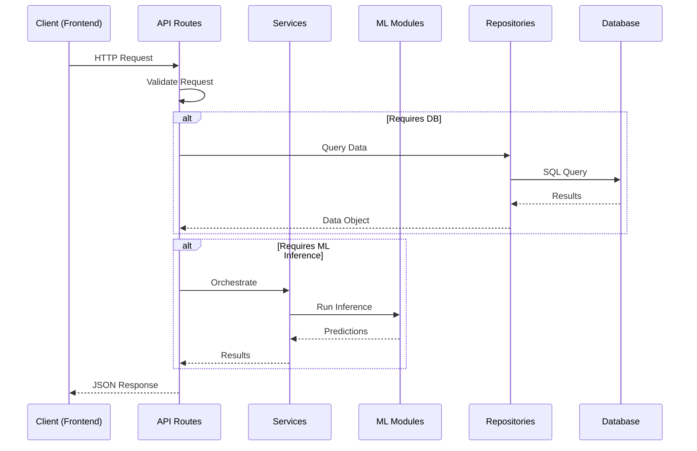
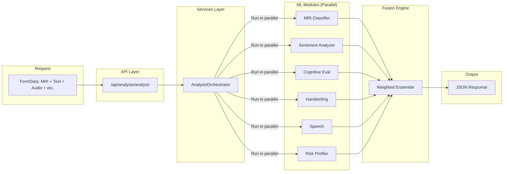

# NeuroSense AI — Backend

> Flask API Server for Multimodal Alzheimer's Detection

[](https://www.python.org/)
[](https://flask.palletsprojects.com/)
[](https://pytorch.org/)

---

## Overview

The NeuroSense backend is a **RESTful API server** built with Flask. It provides endpoints for authentication, patient management, and multimodal AI analysis.

**Key Principles:**
- Pure API server (no HTML rendering)
- Clean architecture separation
- JSON-only responses
- CORS enabled for frontend integration

---

## 🧠 Request Lifecycle

Understanding how a request flows through the system:



---

## Architecture

### Layer Structure

```
┌─────────────────────────────────────────┐
│           API Layer (Routes)            │
│    auth.py │ analysis.py │ patients.py │
└─────────────────────────────────────────┘
                    │
                    ▼
┌─────────────────────────────────────────┐
│         Services Layer (Business)        │
│   AnalysisOrchestrator │ ReportService  │
└─────────────────────────────────────────┘
                    │
                    ▼
┌─────────────────────────────────────────┐
│         Modules Layer (ML Inference)     │
│   MRI │ NLP │ Vision │ Speech │ Fusion  │
└─────────────────────────────────────────┘
                    │
                    ▼
┌─────────────────────────────────────────┐
│       Repositories Layer (Data)          │
│   User │ Patient │ Session Repository    │
└─────────────────────────────────────────┘
                    │
                    ▼
┌─────────────────────────────────────────┐
│          Core Layer (Infrastructure)     │
│     Config │ Database │ Security         │
└─────────────────────────────────────────┘
```

### How `/api/analysis/analyze` Works



---

## Folder Structure

### `app/api/`

**Request handling layer** — Flask blueprints that handle HTTP requests/responses.

| File | Description |
|------|-------------|
| `routes/auth.py` | Authentication endpoints (`/api/auth/*`) |
| `routes/analysis.py` | Multimodal analysis endpoints (`/api/analysis/*`) |
| `routes/patients.py` | Patient CRUD endpoints (`/api/patients/*`) |
| `routes/utilities.py` | Chat, music, report endpoints (`/api/utils/*`) |
| `schemas/` | Request/response validation schemas |

### `app/services/`

**Business logic orchestration** — Coordinates between API and ML modules.

| File | Description |
|------|-------------|
| `analysis_service.py` | Orchestrates full multimodal pipeline |
| `report_service.py` | PDF report generation |
| `chatbot_service.py` | AI chatbot integration |
| `music_service.py` | Music recommendation engine |

### `app/modules/`

**ML inference modules** — Pure prediction logic (no Flask dependencies).

| Module | Path | Description |
|--------|------|-------------|
| **MRI** | `modules/mri/inference.py` | Brain scan classification (EfficientNet) |
| **NLP** | `modules/nlp/sentiment.py` | Text sentiment & cognitive markers |
| **Cognitive** | `modules/cognitive/evaluator.py` | MMSE-based assessment |
| **Risk** | `modules/risk/profiler.py` | Risk factor analysis |
| **Vision - Facial** | `modules/vision/facial/analyzer.py` | Emotion from webcam |
| **Vision - Handwriting** | `modules/vision/handwriting/analyzer.py` | Tremor detection |
| **Speech** | `modules/speech/transcriber.py` | Audio transcription |
| **Genomics** | `modules/genomics/sequencer.py` | DNA sequence parsing |
| **Fusion** | `modules/fusion/engine.py` | Weighted ensemble |
| **Recommendation** | `modules/recommendation/` | Music & chatbot |

### `app/repositories/`

**Data access layer** — Abstracts database operations.

| File | Description |
|------|-------------|
| `user_repository.py` | User authentication & management |
| `patient_repository.py` | Patient CRUD operations |
| `session_repository.py` | Analysis session history |

### `app/core/`

**Infrastructure** — Cross-cutting concerns.

| File | Description |
|------|-------------|
| `config.py` | Application configuration |
| `database.py` | SQLite connection management |
| `security.py` | Password hashing, session management |
| `exceptions.py` | Custom exception classes |

---

## 🛠️ How to Add a New ML Module

Here's a step-by-step guide for adding a new ML module (e.g., Sleep Analysis):

### Step 1: Create the Module
```python
# app/modules/sleep/analyzer.py
import torch

class SleepAnalyzer:
    def __init__(self):
        self.model = self._load_model()
    
    def _load_model(self):
        # Load your trained model
        return torch.load(...)
    
    def analyze(self, sleep_data):
        # Your inference logic
        return {"sleep_score": 0.75, "disruption_count": 3}
```

### Step 2: Register in App Initialization
```python
# app/__init__.py
def get_modules():
    from app.modules.sleep.analyzer import SleepAnalyzer
    _modules_cache['sleep'] = SleepAnalyzer()
```

### Step 3: Add Service (Optional)
```python
# app/services/sleep_service.py
class SleepAnalysisService:
    def analyze(self, data):
        modules = get_modules()
        return modules['sleep'].analyze(data)
```

### Step 4: Create API Endpoint
```python
# app/api/routes/analysis.py
@analysis_bp.route('/sleep', methods=['POST'])
def analyze_sleep():
    data = request.get_json()
    result = sleep_service.analyze(data)
    return jsonify(result)
```

### Step 5: Register the Module
```python
# app/__init__.py
app.register_blueprint(analysis.analysis_bp)  # Already includes /sleep
```

---

## Running the Backend

### Quick Start

```bash
# Navigate to backend directory
cd backend

# Create virtual environment (recommended)
python -m venv venv

# Activate virtual environment
# Linux/Mac:
source venv/bin/activate
# Windows:
venv\Scripts\activate

# Install dependencies
pip install -r requirements.txt

# Run the server
python run.py
```

The API server starts at **http://127.0.0.1:5000**

### Verify Server

```bash
# Health check
curl http://127.0.0.1:5000/

# Expected response:
# {"endpoints": {...}, "message": "NeuroSense AI API Server", "version": "1.0.0"}
```

---

## API Endpoints

### Authentication (`/api/auth`)

| Endpoint | Method | Description |
|----------|--------|-------------|
| `/api/auth/login` | POST | User login |
| `/api/auth/register` | POST | User registration |
| `/api/auth/logout` | POST | User logout |
| `/api/auth/current-user` | GET | Get current user |

#### Example: Login

**Request:**
```bash
curl -X POST http://127.0.0.1:5000/api/auth/login \
  -H "Content-Type: application/json" \
  -d '{"username":"doctor","password":"doctor123"}'
```

**Response:**
```json
{
  "success": true,
  "user": {
    "id": 1,
    "username": "doctor",
    "email": "doctor@example.com",
    "role": "doctor",
    "full_name": "Dr. Demo"
  }
}
```

#### Example: Register

**Request:**
```bash
curl -X POST http://127.0.0.1:5000/api/auth/register \
  -H "Content-Type: application/json" \
  -d '{
    "username": "doctor",
    "email": "doctor@example.com",
    "password": "doctor123",
    "role": "doctor",
    "full_name": "Dr. Demo"
  }'
```

**Response:**
```json
{
  "success": true,
  "message": "User created successfully"
}
```

---

### Patients (`/api/patients`)

| Endpoint | Method | Description |
|----------|--------|-------------|
| `/api/patients` | GET | List all patients |
| `/api/patients` | POST | Create patient |
| `/api/patients/<id>` | GET | Get patient |
| `/api/patients/<id>` | PUT | Update patient |
| `/api/patients/<id>` | DELETE | Delete patient |
| `/api/patients/history/<id>` | GET | Patient analysis history |
| `/api/patients/export/<id>` | GET | Export CSV |

#### Example: Get Patients

```bash
curl -X GET http://127.0.0.1:5000/api/patients \
  -H "Content-Type: application/json"
```

**Response:**
```json
{
  "patients": [
    {
      "id": 1,
      "patient_id": "P001",
      "name": "John Doe",
      "age": 72,
      "sex": "M",
      "stage": "Mild Demented"
    }
  ]
}
```

---

### Analysis (`/api/analysis`)

| Endpoint | Method | Description |
|----------|--------|-------------|
| `/api/analysis/analyze` | POST | Full multimodal analysis |
| `/api/analysis/mri` | POST | MRI classification |
| `/api/analysis/sentiment` | POST | Text sentiment analysis |
| `/api/analysis/cognitive` | POST | Cognitive test evaluation |
| `/api/analysis/risk` | POST | Risk factor assessment |
| `/api/analysis/handwriting` | POST | Handwriting analysis |
| `/api/analysis/genomics` | POST | DNA sequence analysis |
| `/api/analysis/transcribe` | POST | Audio transcription |

#### Example: Full Analysis

**Request:**
```bash
curl -X POST http://127.0.0.1:5000/api/analysis/analyze \
  -F "name=John Doe" \
  -F "age=72" \
  -F "patient_id=P001" \
  -F "mri_image=@mri_scan.jpg"
```

**Response:**
```json
{
  "patient_info": {
    "name": "John Doe",
    "age": "72",
    "patient_id": "P001"
  },
  "mri": {
    "stage": "Mild Demented",
    "confidence": 0.87,
    "probabilities": {
      "Non Demented": 0.02,
      "Very Mild Demented": 0.08,
      "Mild Demented": 0.87,
      "Moderate Demented": 0.03
    }
  },
  "sentiment": {
    "dominant_emotion": "neutral",
    "cognitive_risk_score": 0.42
  },
  "cognitive": {
    "composite_score": 18,
    "mmse_equivalent": "Mild Impairment"
  },
  "final_stage": {
    "stage": "Mild Demented",
    "confidence": 0.82
  },
  "music": {
    "recommendations": ["classical_piano", "ambient_nature"]
  },
  "session_id": 42
}
```

#### Example: Sentiment Analysis

**Request:**
```bash
curl -X POST http://127.0.0.1:5000/api/analysis/sentiment \
  -H "Content-Type: application/json" \
  -d '{"text":"The patient appears confused and has difficulty remembering recent events."}'
```

**Response:**
```json
{
  "dominant_emotion": "sadness",
  "emotion_scores": {
    "joy": 0.05,
    "sadness": 0.65,
    "anger": 0.1,
    "fear": 0.15,
    "surprise": 0.05
  },
  "cognitive_risk_score": 0.72,
  "keywords": ["confused", "difficulty", "remembering"]
}
```

---

### Utilities (`/api/utils`)

| Endpoint | Method | Description |
|----------|--------|-------------|
| `/api/utils/chat` | POST | AI medical chatbot |
| `/api/utils/music` | POST | Music recommendations |
| `/api/utils/report` | POST | Generate PDF report |

#### Example: Chat

**Request:**
```bash
curl -X POST http://127.0.0.1:5000/api/utils/chat \
  -H "Content-Type: application/json" \
  -d '{
    "query": "What is the patient\'s cognitive score trend?",
    "patient_id": "P001"
  }'
```

**Response:**
```json
{
  "answer": "Based on the analysis history, the patient's cognitive scores have shown a gradual decline over the past 6 months, dropping from 24 to 18 on the MMSE scale..."
}
```

---

## Environment Variables

Create a `.env` file in the `backend/` directory:

```bash
# Required
FLASK_SECRET_KEY=your-production-secret-key

# Optional - AI Services
GEMINI_API_KEY=your-gemini-api-key
GROQ_API_KEY=your-groq-api-key
```

---

## ML Modules Detail

### MRI Classification (`modules/mri/`)

- **Model**: EfficientNet-B0 fine-tuned on OASIS-1 dataset
- **Input**: Brain MRI scans (axial view)
- **Output**: 
  - Stage: `Non Demented | Very Mild Demented | Mild Demented | Moderate Demented`
  - Confidence score (0-1)
  - Per-class probabilities

### Multimodal Fusion (`modules/fusion/`)

- **Method**: Weighted ensemble
- **Inputs**: All modality outputs
- **Output**: Final stage + weighted confidence

---

## Database

### Schema

The backend uses SQLite (`patient_data.db` in project root).

**Tables:**
- `users` — System users (doctors, admins)
- `patients` — Patient records
- `sessions` — Analysis sessions with full results

### Database Path

The database is located at the project root: `../patient_data.db`

This is configured in `app/core/config.py`:
```python
DB_PATH = ROOT_DIR / 'patient_data.db'
```

---

## Error Handling

All errors return JSON:

```json
{
  "error": "Error message description"
}
```

| Status Code | Description |
|-------------|-------------|
| 400 | Bad Request — Invalid input |
| 401 | Unauthorized — Not logged in |
| 404 | Not Found — Resource doesn't exist |
| 413 | Payload Too Large — File > 16MB |
| 500 | Internal Server Error |

---

## CORS Configuration

CORS is enabled for all origins in development. Configure in `app/__init__.py`:

```python
from flask_cors import CORS
CORS(app, supports_credentials=True)
```

---

## Production Readiness

| Feature | Status | Implementation |
|---------|--------|----------------|
| Environment Variables | ✅ | `.env` file |
| Error Handling | ✅ | Global handlers in `app/__init__.py` |
| File Validation | ✅ | Size limits, allowed extensions |
| Database | ✅ | SQLite (swappable to PostgreSQL) |
| Docker | ✅ | `docker-compose.yml` |
| Authentication | ✅ | Flask-Login sessions |
| CORS | ✅ | Flask-CORS |

---

## Future Improvements

- [ ] Celery task queue for async ML inference
- [ ] PostgreSQL for production database
- [ ] API rate limiting
- [ ] JWT authentication
- [ ] Model versioning with MLflow
- [ ] Docker multi-stage builds

---

## File Reference

### Entry Point

- `run.py` — Flask application factory invocation

### Configuration

- `app/core/config.py` — Central configuration

### Tests

- `tests/` — pytest test suite
