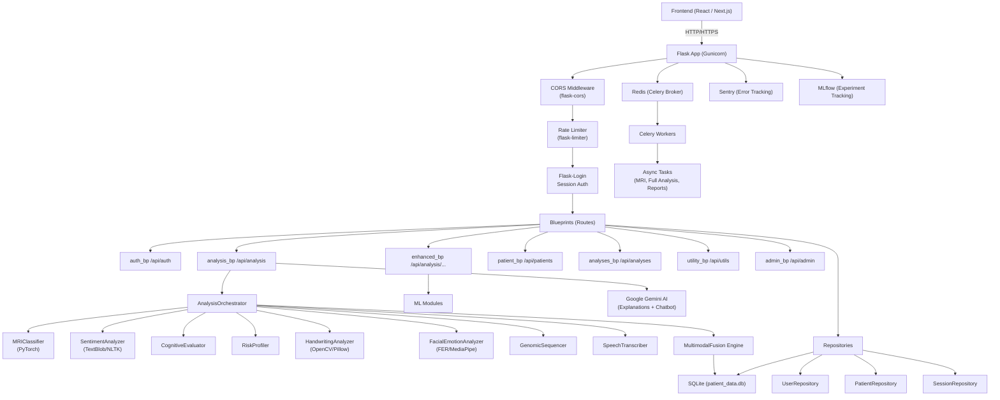
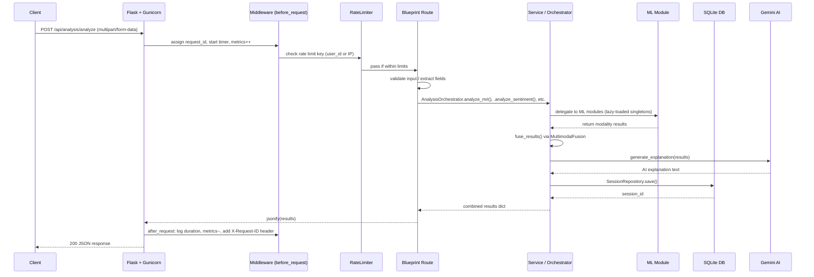
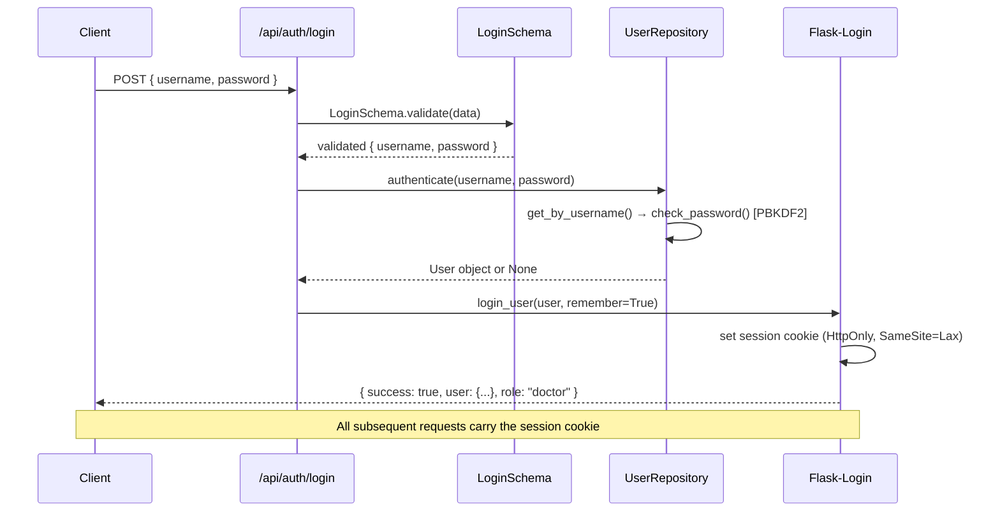
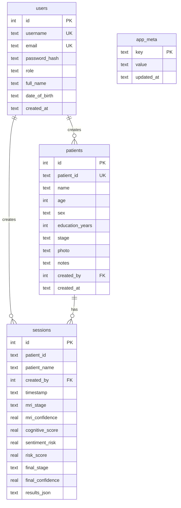
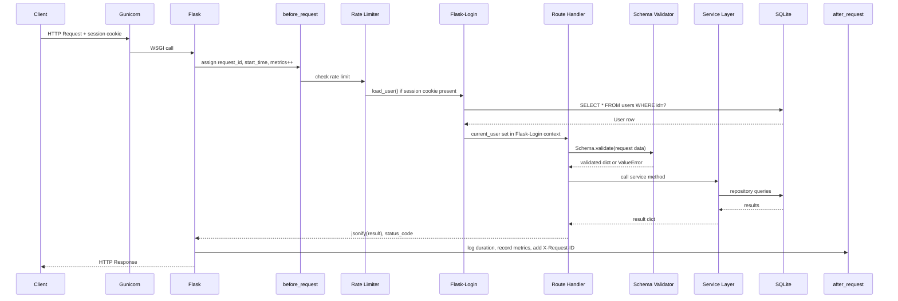

# NeuroSense AI — Backend

> **Comprehensive technical reference for senior developers, DevOps engineers, and AI coding assistants.**
> Everything needed to understand, maintain, extend, and integrate with this backend — without reading the source code first.

---

## Table of Contents

1. [Project Overview](#1-project-overview)
2. [High-Level Architecture](#2-high-level-architecture)
3. [Folder Structure](#3-folder-structure)
4. [File-by-File Documentation](#4-file-by-file-documentation)
5. [API Documentation](#5-api-documentation)
6. [Authentication & Authorization](#6-authentication--authorization)
7. [Middleware](#7-middleware)
8. [Controllers (Routes)](#8-controllers-routes)
9. [Services](#9-services)
10. [Database](#10-database)
11. [Models & Repositories](#11-models--repositories)
12. [Request Lifecycle](#12-request-lifecycle)
13. [Business Logic — ML Analysis Pipeline](#13-business-logic--ml-analysis-pipeline)
14. [Environment Variables](#14-environment-variables)
15. [Configuration](#15-configuration)
16. [Validation & Schemas](#16-validation--schemas)
17. [Error Handling](#17-error-handling)
18. [Logging](#18-logging)
19. [External Services & Integrations](#19-external-services--integrations)
20. [Scheduled Jobs & Async Tasks](#20-scheduled-jobs--async-tasks)
21. [File Upload System](#21-file-upload-system)
22. [Security](#22-security)
23. [Performance & Metrics](#23-performance--metrics)
24. [Frontend Integration Guide](#24-frontend-integration-guide)
25. [API Flow Examples](#25-api-flow-examples)
26. [Dependency Graph](#26-dependency-graph)
27. [Known Limitations](#27-known-limitations)
28. [AI Context](#28-ai-context)
29. [Developer Guide](#29-developer-guide)
30. [Future Improvements](#30-future-improvements)

---

## 🚀 Quick Start — How to Run This Project

### Prerequisites

| Tool | Version | Notes |
|------|---------|-------|
| Python | 3.11+ | 3.12 recommended |
| pip | Latest | Comes with Python |
| Git | Any | To clone the repo |

---

### Step 1 — Clone & Enter the Backend

```bash
git clone <your-repo-url>
cd neurosense-ai/backend
```

---

### Step 2 — Create a Virtual Environment

```bash
# Windows
python -m venv venv
venv\Scripts\activate

# Mac / Linux
python3 -m venv venv
source venv/bin/activate
```

---

### Step 3 — Install Dependencies

```bash
pip install -r requirements.txt
```

> **Note (OS Specific):** `python-magic-bin` handles file type detection on Windows (included in `requirements.txt`).
> On Linux/Mac, if needed, replace `python-magic-bin` with `python-magic` in `requirements.txt`.

---

### Step 4 — Configure Environment Variables

Copy the `.env` file (already present in the backend root) and fill in your API keys:

```bash
# The .env file is already at backend/.env
# Open it and edit the values you need:
```

| Variable | Required | Default | Description |
|----------|----------|---------|-------------|
| `SECRET_KEY` | ✅ Yes | dev fallback | Flask session signing key |
| `FLASK_ENV` | No | `development` | `development` or `production` |
| `PORT` | No | `5000` | Port the server listens on |
| `CORS_ORIGINS` | No | localhost origins | Comma-separated allowed frontend URLs |
| `GEMINI_API_KEY` | For AI chat | — | Google Gemini API key (chatbot + explanations) |
| `GROQ_API_KEY` | For AI chat | — | Groq/LLaMA API key (alternative chatbot) |
| `LOG_LEVEL` | No | `INFO` | `DEBUG`, `INFO`, `WARNING`, `ERROR` |
| `RATELIMIT_STORAGE` | No | `memory://` | Use `redis://localhost:6379` in production |
| `SENTRY_DSN` | No | *(empty)* | Sentry error tracking DSN |
| `MLFLOW_TRACKING_URI` | No | `http://localhost:5001` | MLflow experiment tracking server |
| `TESTING` | No | `0` | Set to `1` when running pytest |

> **Get a free Gemini API key**: https://aistudio.google.com/app/apikey

---

### Step 5 — Run the Backend Server

```bash
# Development mode (auto-reload)
python run.py

# OR using Flask CLI
flask --app run:app run --debug --port 5000
```

Server will start at: **http://localhost:5000**

Verify it's running:
```bash
curl http://localhost:5000/api/health
```

Expected response:
```json
{
  "status": "healthy",
  "services": { "database": "connected", "models": "missing", "api": "operational" }
}
```

> `models: missing` is normal until a trained `alzheimer_model.pth` is placed in `app/models/`.

---

### Step 6 — (Optional) Add Your Trained MRI Model

Place your trained model weights file in:
```
backend/app/models/alzheimer_model.pth
```

The model file is a PyTorch `state_dict` from the `AlzheimerModel` class (4-class ensemble).
See the [Google Colab training guide](#13-business-logic--ml-analysis-pipeline) for how to train it.

---

### Step 7 — Run Tests

```bash
# Make sure TESTING=1 in .env or set inline:
TESTING=1 pytest tests/ -v

# Windows PowerShell:
$env:TESTING=1; pytest tests/ -v
```

---

### Production Deployment (Gunicorn)

```bash
gunicorn "run:app" --bind 0.0.0.0:10000 --workers 4 --timeout 120
```

Set `PORT=10000` in your deployment environment's env vars (e.g. Render.com).

---

### Default Login Credentials (Development Only)

| Username | Password | Role |
|----------|----------|------|
| `admin` | `Admin@123!` | Admin |
| `doctor` | `Doctor@123` | Doctor |

> These are auto-seeded when `FLASK_ENV != production`. **Never use in production.**

---

## 1. Project Overview


### What This Backend Does

NeuroSense AI is a **multimodal Alzheimer's Disease (AD) detection and clinical decision support platform**. It accepts data from up to 8 simultaneous modalities (MRI brain scans, speech, handwriting, facial emotion, NLP/text, cognitive tests, genomic sequences, and blood biomarkers), fuses the results using a weighted ensemble, and returns a unified dementia staging prediction along with clinical recommendations, music therapy suggestions, and a downloadable PDF report.

### Business Domain

- **Domain**: Clinical Neuroscience / Digital Health / AI-Assisted Diagnostics
- **Primary Users**: Neurologists, Geriatricians, and Medical Researchers
- **Secondary Users**: Hospital Administrators (via Admin panel)
- **End Goal**: Early, multi-evidence Alzheimer's staging to guide treatment decisions

### Main Features

| Feature | Description |
|---|---|
| MRI Classification | ResNet/EfficientNet-based 4-class Alzheimer's staging with Grad-CAM heatmaps |
| NLP Sentiment Analysis | TextBlob + NLTK analysis of patient speech/text for cognitive risk indicators |
| Facial Emotion Recognition | FER + MediaPipe webcam frame analysis |
| Handwriting Analysis | Computer vision analysis of spiral/clock drawing tests |
| Cognitive Testing | MMSE, MoCA, CDR, Mini-Cog, serial-7s batteries |
| Genomic Sequencing Analysis | DNA text mutation risk profiling for APOE/PSEN genes |
| Speech Transcription | SpeechRecognition-based audio → text → NLP pipeline |
| Multimodal Fusion | Weighted ensemble fusion of all modalities into a final stage |
| Blood Biomarker Analysis | Amyloid-β, Tau, p-Tau ratios for AD risk |
| Clinical Decision Support | Treatment recommendations, prognosis, clinical trial matching |
| AI Explanation | Google Gemini-powered natural language explanation of results |
| PDF Report Generation | ReportLab-rendered clinical summary report |
| Music Therapy | Mood/stage-based music recommendations |
| Medical Chatbot | Gemini-powered contextual Q&A against patient history |
| Patient Management | Full CRUD with per-doctor data isolation |
| Admin Dashboard | System-wide analytics, doctor/patient management |
| Audit Logging | Structured audit trail for all clinical actions |
| Metrics & Monitoring | In-process Prometheus-compatible metrics + Sentry integration |

### Tech Stack

| Layer | Technology |
|---|---|
| **Language** | Python 3.11+ |
| **Framework** | Flask 3.x |
| **WSGI Server** | Gunicorn 21+ |
| **Database** | SQLite (file: `patient_data.db`) |
| **ORM** | Raw SQL via `sqlite3` module (no ORM) |
| **Authentication** | Session-based (Flask-Login + Werkzeug PBKDF2 password hashing) |
| **Task Queue** | Celery 5.x |
| **Message Broker** | Redis |
| **ML Runtime** | PyTorch 2.x, TorchVision, timm |
| **Computer Vision** | OpenCV, Pillow, FER, MediaPipe |
| **NLP** | TextBlob, NLTK |
| **Speech** | SpeechRecognition |
| **AI/LLM** | Google GenAI (Gemini) |
| **Explainability** | SHAP, LIME |
| **Experiment Tracking** | MLflow |
| **Error Tracking** | Sentry SDK |
| **Reports** | ReportLab |
| **Rate Limiting** | Flask-Limiter |
| **CORS** | Flask-CORS |
| **Deployment** | Render.com (port env var `PORT=10000`), Gunicorn |

### Runtime

- **Port**: `10000` (default, via `PORT` env var)
- **Host**: `0.0.0.0` (all interfaces)
- **Debug**: `False` in production

---

## 2. High-Level Architecture

### Overall System Architecture


```mermaid
graph TD
    Client["Frontend (React / Next.js)"] -->|HTTP/HTTPS| Flask["Flask App (Gunicorn)"]
    Flask --> CORS["CORS Middleware<br/>(flask-cors)"]
    CORS --> RateLimit["Rate Limiter<br/>(flask-limiter)"]
    RateLimit --> Auth["Flask-Login<br/>Session Auth"]
    Auth --> Blueprints["Blueprints (Routes)"]

    Blueprints --> AuthBP["auth_bp /api/auth"]
    Blueprints --> AnalysisBP["analysis_bp /api/analysis"]
    Blueprints --> EnhancedBP["enhanced_bp /api/analysis/..."]
    Blueprints --> PatientBP["patient_bp /api/patients"]
    Blueprints --> AnalysesBP["analyses_bp /api/analyses"]
    Blueprints --> UtilityBP["utility_bp /api/utils"]
    Blueprints --> AdminBP["admin_bp /api/admin"]

    AnalysisBP --> Orchestrator["AnalysisOrchestrator"]
    EnhancedBP --> Modules["ML Modules"]

    Orchestrator --> MRI["MRIClassifier<br/>(PyTorch)"]
    Orchestrator --> NLP["SentimentAnalyzer<br/>(TextBlob/NLTK)"]
    Orchestrator --> Cog["CognitiveEvaluator"]
    Orchestrator --> Risk["RiskProfiler"]
    Orchestrator --> HW["HandwritingAnalyzer<br/>(OpenCV/Pillow)"]
    Orchestrator --> Face["FacialEmotionAnalyzer<br/>(FER/MediaPipe)"]
    Orchestrator --> Genome["GenomicSequencer"]
    Orchestrator --> Speech["SpeechTranscriber"]
    Orchestrator --> Fusion["MultimodalFusion Engine"]

    Fusion --> DB["SQLite (patient_data.db)"]
    AnalysisBP --> Gemini["Google Gemini AI<br/>(Explanations + Chatbot)"]

    Blueprints --> Repos["Repositories"]
    Repos --> UserRepo["UserRepository"]
    Repos --> PatientRepo["PatientRepository"]
    Repos --> SessionRepo["SessionRepository"]
    Repos --> DB

    Flask --> Redis["Redis (Celery Broker)"]
    Redis --> Celery["Celery Workers"]
    Celery --> AsyncTasks["Async Tasks<br/>(MRI, Full Analysis, Reports)"]

    Flask --> Sentry["Sentry (Error Tracking)"]
    Flask --> MLflow["MLflow (Experiment Tracking)"]
```

### Request Flow


```mermaid
sequenceDiagram
    participant C as Client
    participant F as Flask + Gunicorn
    participant MW as Middleware (before_request)
    participant RL as RateLimiter
    participant BP as Blueprint Route
    participant S as Service / Orchestrator
    participant M as ML Module
    participant DB as SQLite DB
    participant G as Gemini AI

    C->>F: POST /api/analysis/analyze (multipart/form-data)
    F->>MW: assign request_id, start timer, metrics++
    MW->>RL: check rate limit key (user_id or IP)
    RL->>BP: pass if within limits
    BP->>BP: validate input / extract fields
    BP->>S: AnalysisOrchestrator.analyze_mri(), .analyze_sentiment(), etc.
    S->>M: delegate to ML modules (lazy-loaded singletons)
    M-->>S: return modality results
    S->>S: fuse_results() via MultimodalFusion
    S->>G: generate_explanation(results)
    G-->>S: AI explanation text
    S->>DB: SessionRepository.save()
    DB-->>S: session_id
    S-->>BP: combined results dict
    BP-->>F: jsonify(results)
    F->>MW: after_request: log duration, metrics--, add X-Request-ID header
    F-->>C: 200 JSON response
```

### Authentication Flow


```mermaid
sequenceDiagram
    participant C as Client
    participant A as /api/auth/login
    participant V as LoginSchema
    participant R as UserRepository
    participant FL as Flask-Login

    C->>A: POST { username, password }
    A->>V: LoginSchema.validate(data)
    V-->>A: validated { username, password }
    A->>R: authenticate(username, password)
    R->>R: get_by_username() → check_password() [PBKDF2]
    R-->>A: User object or None
    A->>FL: login_user(user, remember=True)
    FL->>FL: set session cookie (HttpOnly, SameSite=Lax)
    FL-->>C: { success: true, user: {...}, role: "doctor" }
    Note over C,FL: All subsequent requests carry the session cookie
```

---

## 3. Folder Structure

```text
backend/
├── run.py                    # Application entry point (Gunicorn target: app:create_app())
├── run_celery.py             # Celery worker entry point
├── celery_beat.py            # Celery beat (cron) schedule definitions
├── requirements.txt          # All Python dependencies
├── pytest.ini                # Pytest configuration
├── runtime.txt               # Deployment runtime spec (e.g. python-3.11.x)
├── patient_data.db           # SQLite database file (auto-created)
├── uploads/                  # Temporary file upload directory (auto-created)
│
├── app/                      # Main application package
│   ├── __init__.py           # App factory (create_app), blueprint registration, middleware setup
│   ├── extensions.py         # Flask extension stubs (LoginManager)
│   ├── celery_app.py         # Celery instance + task routing/rate-limit config
│   │
│   ├── api/                  # HTTP interface layer
│   │   ├── routes/           # Blueprint route handlers (controllers)
│   │   │   ├── auth.py       # /api/auth — login, register, logout, current-user, forgot-password
│   │   │   ├── analysis.py   # /api/analysis — core multimodal analysis endpoints
│   │   │   ├── enhanced_analysis.py  # /api/analysis/biomarkers, neuropsychological, CDS, etc.
│   │   │   ├── patients.py   # /api/patients — CRUD + history + CSV export
│   │   │   ├── analyses.py   # /api/analyses — session/analysis history listing
│   │   │   ├── admin.py      # /api/admin — admin dashboard, doctor/patient management
│   │   │   └── utilities.py  # /api/utils — chat, music, report generation
│   │   └── schemas/          # Request validation schemas (no third-party lib)
│   │       ├── auth.py       # LoginSchema, RegisterSchema, ForgotPasswordSchema
│   │       ├── analysis.py   # SentimentSchema, CognitiveTestSchema, RiskProfileSchema
│   │       └── patient.py    # PatientSchema (create + update)
│   │
│   ├── core/                 # Infrastructure / cross-cutting concerns
│   │   ├── config.py         # Config class — paths, secrets, upload limits, session settings
│   │   ├── database.py       # Database singleton — connection pooling, schema init, migrations
│   │   ├── security.py       # Auth decorators, password hashing, session helpers
│   │   ├── middleware.py     # ErrorHandler, ErrorResponse, decorators (handle_errors, require_auth, log_request)
│   │   ├── exceptions.py     # Custom exception hierarchy (NeuroSenseError → subclasses)
│   │   ├── validation.py     # InputValidator, RequestValidator, sanitize_input decorator
│   │   ├── logging_config.py # StructuredFormatter (JSON), AuditLogger, setup_logging()
│   │   ├── metrics.py        # MetricsCollector singleton — Prometheus + JSON metrics
│   │   └── mlflow_config.py  # MLflow experiment tracking configuration
│   │
│   ├── repositories/         # Data access layer (raw SQLite)
│   │   ├── __init__.py       # BaseRepository base class
│   │   ├── user_repository.py    # UserRepository + User model class + seed data
│   │   ├── patient_repository.py # PatientRepository + seed patients
│   │   └── session_repository.py # SessionRepository (analysis history)
│   │
│   ├── services/             # Business logic orchestration layer
│   │   ├── analysis_service.py       # AnalysisOrchestrator (singleton) — delegates to all ML modules
│   │   ├── explanation_service.py    # generate_explanation() via Gemini
│   │   ├── recommendation_service.py # generate_recommendations() — lifestyle/clinical tips
│   │   ├── report_service.py         # ReportOrchestrator — ReportLab PDF generation
│   │   ├── patient_service.py        # Patient-level business operations
│   │   ├── patient_history.py        # Patient history aggregation helpers
│   │   ├── chatbot_service.py        # MedicalChatbotService — Gemini Q&A
│   │   └── music_service.py          # MusicRecommendationService — stage/emotion → playlist
│   │
│   ├── modules/              # ML/AI modality modules
│   │   ├── mri/              # MRI brain scan classification (PyTorch model)
│   │   ├── nlp/              # Sentiment analysis (TextBlob + NLTK)
│   │   ├── cognitive/        # Cognitive test scoring (MMSE, MoCA, CDR, etc.)
│   │   ├── risk/             # Risk factor profiling (comorbidities, lifestyle)
│   │   ├── vision/
│   │   │   ├── handwriting/  # Handwriting disorder detection (OpenCV/Pillow)
│   │   │   └── facial/       # Facial emotion recognition (FER + MediaPipe)
│   │   ├── fusion/           # Multimodal weighted ensemble fusion
│   │   ├── genomics/         # DNA sequence mutation analysis
│   │   ├── speech/           # Audio transcription (SpeechRecognition)
│   │   ├── analysis/         # Blood biomarkers + neuropsychological batteries
│   │   ├── clinical/         # Master prompt CDSS (master_prompt.py), clinical decision support, prognosis, trials
│   │   ├── explainability/   # SHAP/LIME model explainability
│   │   ├── quality/          # QA monitoring, feedback logging
│   │   └── reporting/        # Clinical HTML/PDF report generator
│   │
│   ├── tasks/                # Celery async task definitions
│   │   ├── mri_tasks.py      # Async MRI classification task
│   │   ├── analysis_tasks.py # Async full analysis, report generation, notifications
│   │   └── maintenance.py    # Cron: cleanup, daily summary, health check
│   │
│   └── models/               # Trained ML model files
│       └── alzheimer_model.pth  # Fine-tuned ResNet/EfficientNet (~68 MB)
│
└── tests/                    # Test suite
    ├── conftest.py            # Pytest fixtures (app, client, auth helpers)
    ├── test_auth.py           # Authentication endpoint tests
    ├── test_api.py            # Core API smoke tests
    ├── test_analyses_route.py # Analysis history route tests
    ├── test_modules.py        # ML module unit tests
    ├── test_schemas.py        # Schema validation tests
    ├── test_validation.py     # InputValidator/RequestValidator tests
    ├── test_fusion.py         # MultimodalFusion engine tests
    ├── test_genomics.py       # GenomicSequencer tests
    ├── test_facial_emotion.py # FacialEmotionAnalyzer tests
    ├── test_explanation_service.py # Explanation service tests
    └── test_database_integrity.py  # DB schema/constraint tests
```

---

## 4. File-by-File Documentation

### `run.py`
**Purpose**: Production application entry point.
**Responsibilities**: Creates the `uploads/` and `models/` directories, instantiates the Flask app via `create_app()`, and starts the Gunicorn-compatible server on `host=0.0.0.0, port=$PORT`.
**Used by**: Gunicorn (`gunicorn run:app`), direct `python run.py`.

---

### `app/__init__.py` — Application Factory
**Purpose**: Flask application factory. Wires together every subsystem.
**Key exports**: `create_app()`, `get_limiter()`, `get_modules()`
**Responsibilities**:
- Initializes CORS, Flask-Login, Flask-Limiter
- Calls `_init_database()` → `Database.get_instance()` → `db.init_schema()`
- Registers all 7 blueprints
- Registers global error handlers (404, 413, 429, 500, `NeuroSenseError`)
- Attaches `before_request` / `after_request` hooks for request-id, timing, and metrics
- Initializes Sentry if `SENTRY_DSN` env var is set
- Exposes `/`, `/api/health`, `/api/metrics` system routes

---

### `app/core/config.py` — Configuration
**Purpose**: Single source of truth for all runtime configuration.
**Key settings**:
- `SECRET_KEY` — Session signing key (from env or dev fallback)
- `DB_PATH` — `<project_root>/patient_data.db`
- `MODEL_PATH` — `app/models/alzheimer_model.pth`
- `UPLOAD_FOLDER` — `app/uploads/`
- `MAX_CONTENT_LENGTH` — 16 MB
- Session cookie: `HttpOnly=True`, `Secure=False`, `SameSite=Lax`

---

### `app/core/database.py` — Database Manager
**Purpose**: Thread-safe SQLite singleton with context-manager connection handling.
**Pattern**: Singleton (`Database._instance`)
**Key methods**:
- `get_instance(db_path)` — Returns or creates the singleton
- `get_connection()` — Context manager; yields connection, commits on exit, rolls back on exception
- `init_schema()` — Creates tables (`users`, `patients`, `sessions`, `app_meta`) and runs safe migrations via `ALTER TABLE IF NOT EXISTS column`
- `fetch_one()`, `fetch_all()` — Return `dict` / `list[dict]` using `sqlite3.Row`
- `get_meta()`, `set_meta()` — Key-value metadata store in `app_meta` table (used for seed tracking)

**Indexes created at startup**:
```sql
idx_patients_created_by, idx_sessions_created_by, idx_sessions_patient_id, idx_users_email
```

---

### `app/core/security.py` — Auth Utilities
**Purpose**: Centralized auth helpers and decorators.
**Key functions**:
- `hash_password(pw)` / `verify_password(pw, hash)` — Werkzeug PBKDF2+SHA256
- `login_user(user)` — Delegates to Flask-Login; sets session cookie
- `logout_user()` — Clears Flask-Login session
- `get_current_user()` — Returns `User` object from Flask-Login or session fallback
- `get_current_user_id()` — Returns `int` or `None`
- `login_required` decorator — Wraps Flask-Login's `@login_required`
- `role_required(*roles)` decorator — Returns 401/403 JSON for unauthenticated/unauthorized
- `admin_required` — Shorthand for `role_required("admin")`
- `doctor_required` — Shorthand for `role_required("admin", "doctor")`

---

### `app/core/middleware.py` — Middleware & Error Handling
**Purpose**: Standardized error responses and reusable route decorators.
**Key classes**:
- `ErrorResponse.format(error, status_code, details)` — Returns `(jsonify(response), status_code)`
- `ErrorHandler.handle(exception)` — Maps exception types to HTTP codes via `error_mapping` dict
- `handle_errors` decorator — try/except wrapper for route handlers
- `require_auth` decorator — Checks session, raises `AuthenticationError`
- `require_role(*roles)` decorator — Checks role, raises `AuthorizationError`
- `log_request` decorator — Logs method, path, duration
- `validate_content_type(*types)` decorator — Returns 415 if Content-Type mismatch

---

### `app/core/exceptions.py` — Exception Hierarchy
```
NeuroSenseError (base, 500)
├── ValidationError      (400)
├── AuthenticationError  (401)
├── AuthorizationError   (403)
├── NotFoundError        (404)
├── AnalysisError        (500)
├── FileProcessingError  (400)
└── DatabaseError        (500)
```

---

### `app/core/validation.py` — Input Validation
**Purpose**: Sanitization and validation utilities.
**Key classes**:
- `InputValidator` — `sanitize_string()`, `sanitize_html()`, `validate_patient_id()`, `validate_name()`, `validate_age()`, `validate_file_type()` (via python-magic)
- `RequestValidator` — `validate_json()`, `validate_form_fields()`
- `validate_request()` decorator — Validates JSON or form fields, stores in `g`
- `sanitize_input` decorator — Strips dangerous chars from all string fields in JSON body

---

### `app/core/logging_config.py` — Logging
**Purpose**: Structured JSON and text logging.
**Key components**:
- `StructuredFormatter` — JSON lines with timestamp, level, logger, hostname, process_id, request_id, exception
- `RequestContextFilter` — Injects `request_id` into every log record
- `AuditLogger` — Specialized methods: `log_authentication()`, `log_patient_access()`, `log_analysis()`, `log_data_export()`
- `setup_logging(level, log_file, json_format)` — Called at app startup; suppresses Werkzeug noise

---

### `app/core/metrics.py` — Metrics Collector
**Purpose**: In-process, thread-safe Prometheus-compatible metrics.
**Pattern**: Singleton
**Exposes**: `GET /api/metrics?format=json|prometheus`
**Tracks**: total requests, active requests, requests by endpoint, requests by status, error rate, request duration histogram (p50/p95/p99), analysis count by modality

---

### `app/celery_app.py` — Celery Configuration
**Purpose**: Celery instance for async ML processing.
**Broker**: `redis://localhost:6379/0`
**Backend**: `redis://localhost:6379/1`
**Queues**: `mri` (MRI tasks), `analysis` (general analysis tasks)
**Limits**: MRI tasks: `10/m`; Full analysis: `5/m`; Task time limit: 600s

---

## 5. API Documentation

### Base URL
- **Development**: `http://localhost:10000`
- **Production**: Configured via deployment environment

### Response Format
All endpoints return JSON. Success responses have `success: true` (where applicable). Error responses always include `success: false` and an `error` field.

```json
// Success
{ "success": true, "user": {...} }

// Error
{ "success": false, "error": "Descriptive message", "status_code": 400 }
```

### System Routes

| Method | Route | Description | Auth |
|--------|-------|-------------|------|
| GET | `/` | API info + endpoint listing | No |
| GET | `/api/health` | Health check (DB + model status) | No |
| GET | `/api/metrics` | App metrics (JSON or Prometheus) | No |

**Health check response:**
```json
{
  "status": "healthy",
  "version": "1.0.0",
  "services": { "database": "connected", "models": "loaded", "api": "operational" },
  "models": { "MRI Classification Model": { "loaded": true } }
}
```

---

### Auth Routes — `/api/auth`

#### POST `/api/auth/login`
| Field | Details |
|-------|---------|
| **Auth required** | No |
| **Content-Type** | `application/json` or `multipart/form-data` |
| **Request body** | `{ "username": "string", "password": "string" }` |
| **Success (200)** | `{ "success": true, "user": { id, username, email, role, full_name, ... }, "role": "doctor" }` |
| **Error (400)** | Validation failure |
| **Error (401)** | Invalid credentials |
| **Side effect** | Sets `session` cookie (HttpOnly) |
| **Controller** | `auth.login()` |
| **Service** | `UserRepository.authenticate()` |

#### POST `/api/auth/register`
| Field | Details |
|-------|---------|
| **Auth required** | No |
| **Request body** | `{ "username", "email", "password" (≥6 chars), "full_name", "date_of_birth" (YYYY-MM-DD) }` |
| **Role assigned** | Always `"doctor"` (self-registration cannot create admins) |
| **Success (200)** | `{ "success": true, "user_id": 5 }` |
| **Error (409)** | Username or email already exists |

#### POST `/api/auth/forgot-password`
| Field | Details |
|-------|---------|
| **Auth required** | No |
| **Request body** | `{ "email", "date_of_birth", "new_password" (optional) }` |
| **Verification** | Email + date_of_birth match |
| **Success** | If `new_password` provided → resets password. Else → `{ "user_id": N }` |

#### POST `/api/auth/logout`
| Field | Details |
|-------|---------|
| **Auth required** | No (clears session regardless) |
| **Response** | `{ "success": true, "message": "Logged out successfully" }` |

#### GET `/api/auth/current-user`
| Field | Details |
|-------|---------|
| **Auth required** | No (returns `authenticated: false` if not logged in) |
| **Response** | `{ "authenticated": true/false, "user": {...}, "role": "doctor" }` |

---

### Analysis Routes — `/api/analysis`

#### POST `/api/analysis/analyze` ⭐ (Primary endpoint)
The main multimodal analysis endpoint. Accepts `multipart/form-data` with any combination of modalities.

| Input Field | Type | Description |
|-------------|------|-------------|
| `name` | form field | Patient name |
| `age` | form field | Patient age (integer) |
| `sex` | form field | Patient sex |
| `patient_id` | form field | Patient ID (alphanumeric + hyphens) |
| `education_years` | form field | Years of education |
| `patient_text` | form field | Text/speech transcript for NLP |
| `mri_image` | file | MRI scan (PNG/JPG/JPEG/GIF/BMP/TIFF) |
| `handwriting_image` | file | Handwriting sample image |
| `handwriting_canvas` | form field | Base64 canvas drawing data |
| `audio_file` | file | Audio file (WAV/MP3/FLAC/WebM/OGG) |
| `audio_text` | form field | Pre-transcribed audio text |
| `webcam_frames` | form field | JSON array of base64 webcam frames |
| `cognitive_tests` | form field | JSON object of cognitive test scores |
| `risk_factors` | form field | JSON array of risk factor objects |
| `dna_file` | file | Plain text DNA sequence file |
| `dna_text` | form field | DNA sequence text |
| `gradcam` | form field | `"true"/"false"` — enable Grad-CAM (default: true) |
| `photo` | form field | Base64 patient photo (data URI) |

**Success Response (200):**
```json
{
  "patient_info": { "name": "...", "age": 72, "patient_id": "PAT-001" },
  "mri": { "stage": "Mild Demented", "confidence": 87.3, "stage_index": 2, "gradcam_image": "..." },
  "sentiment": { "dominant_emotion": "sadness", "cognitive_risk_score": 0.72, "polarity": -0.4 },
  "cognitive": { "composite_score": 21, "mmse_estimate": "Mild impairment" },
  "risk_profile": { "overall_risk_score": 0.65, "high_risk_factors": [...] },
  "handwriting": { "tremor_score": 0.8, "line_consistency": 0.3 },
  "visual_emotion": { "dominant_emotion": "fear", "emotion_scores": {...} },
  "audio_transcription": { "text": "...", "method": "...", "confidence": 90 },
  "audio_sentiment": { "dominant_emotion": "...", "cognitive_risk_score": 0.6 },
  "genomics": { "risk_level": "High", "variants_found": ["APOE ε4", "PSEN1"] },
  "final_stage": { "stage": "Mild Demented", "confidence": 0.83, "stage_index": 2 },
  "music": { "recommendations": [...] },
  "ai_explanation": "Based on the analysis...",
  "recommendations": { "lifestyle": [...], "clinical": [...] },
  "session_id": 42
}
```

#### POST `/api/analysis/mri`
Standalone MRI classification. Accepts `mri_image` file upload + optional `gradcam=true`.

#### POST `/api/analysis/sentiment`
Body: `{ "text": "string" }`. Returns sentiment analysis result.

#### POST `/api/analysis/cognitive`
Body: `{ "mini_cog": 3, "serial_7s": 4, "category_fluency": 12, "digit_span": 6, "orientation": 9 }`.

#### POST `/api/analysis/risk`
Body: JSON array of risk factor objects.

#### POST `/api/analysis/handwriting`
Accepts either `image` file or `{ "canvas_data": "base64..." }` JSON.

#### POST `/api/analysis/genomics`
Accepts `dna_file` upload, `dna_text` form field, or `{ "dna_text": "ATCG..." }` JSON.

#### POST `/api/analysis/transcribe`
Accepts `audio` file upload (WAV/MP3/FLAC/WebM/OGG).

#### POST/GET `/api/analysis/report/pdf`
Generates and downloads a PDF report. POST body: full results JSON.

---

### Enhanced Analysis Routes — `/api/analysis/...`

| Method | Route | Description |
|--------|-------|-------------|
| POST | `/api/analysis/biomarkers` | Blood biomarker AD risk (Aβ42, Tau, p-Tau) |
| POST | `/api/analysis/neuropsychological` | Full MMSE + MoCA + CDR battery |
| POST | `/api/analysis/mmse` | MMSE only |
| POST | `/api/analysis/moca` | MoCA only |
| POST | `/api/analysis/cdr` | CDR only |
| POST | `/api/analysis/clinical-decision-support` | Treatment + monitoring recommendations |
| POST | `/api/analysis/treatment-recommendations` | Stage-specific drug/therapy recommendations |
| POST | `/api/analysis/prognosis` | Disease progression timeline estimation |
| POST | `/api/analysis/clinical-trials` | Matching clinical trials for patient profile |
| POST | `/api/analysis/explain` | SHAP/LIME feature importance explanation |
| POST | `/api/analysis/report` | Clinical HTML or PDF report |
| GET | `/api/analysis/quality-report` | Model QA monitoring statistics |
| POST | `/api/analysis/log-feedback` | Log human feedback for prediction |
| POST | `/api/analysis/comprehensive` | Run all enhanced modules together |

---

### Patient Routes — `/api/patients` *(Auth required)*

| Method | Route | Description | Access |
|--------|-------|-------------|--------|
| GET | `/api/patients` | List patients | Doctor: own; Admin: all |
| POST | `/api/patients` | Create patient | Any authenticated user |
| GET | `/api/patients/<patient_id>` | Get patient details | Owner or Admin |
| PUT | `/api/patients/<patient_id>` | Update patient | Owner or Admin |
| DELETE | `/api/patients/<patient_id>` | Delete patient + sessions | Owner or Admin |
| GET | `/api/patients/history/<patient_id>` | Session history + trends | Owner or Admin |
| GET | `/api/patients/export/<patient_id>` | CSV export of session history | Owner or Admin |

**Create Patient body:**
```json
{ "patient_id": "PAT-001", "name": "Ramesh Kumar", "age": 68, "sex": "M", "education_years": 16, "notes": "..." }
```

---

### Analyses (Sessions) Routes — `/api/analyses` *(Auth required)*

| Method | Route | Description |
|--------|-------|-------------|
| GET | `/api/analyses` | List analyses (doctor: own patients; admin: all) |
| GET | `/api/analyses/<session_id>` | Get full analysis detail with raw results |

---

### Admin Routes — `/api/admin` *(Admin required)*

| Method | Route | Description |
|--------|-------|-------------|
| GET | `/api/admin/dashboard` | Summary stats (users, doctors, patients, analyses, stage distribution) |
| GET | `/api/admin/doctors` | List all doctor accounts |
| DELETE | `/api/admin/doctors/<user_id>` | Delete doctor + cascade patients + sessions |
| GET | `/api/admin/patients` | List all patients |
| DELETE | `/api/admin/patients/<patient_id>` | Delete patient + cascade sessions |
| GET | `/api/admin/analytics` | Analytics data |
| GET | `/api/admin/sessions` | All analysis sessions |

---

### Utility Routes — `/api/utils`

| Method | Route | Auth | Description |
|--------|-------|------|-------------|
| POST | `/api/utils/chat` | No | Medical chatbot (Gemini). Body: `{ "query", "patient_id", "api_key", "provider" }` |
| POST | `/api/utils/music` | No | Music recommendation. Body: `{ "stage", "emotion" }` |
| POST | `/api/utils/report` | No | Generate report PDF. Body: `{ "results", "patient_info" }` |


## 6. Authentication & Authorization

### Authentication Method
- **Type**: Server-side sessions backed by Flask-Login
- **Password hashing**: Werkzeug `generate_password_hash` / `check_password_hash` (PBKDF2+SHA256, salted)
- **Session cookie**: HttpOnly, SameSite=Lax, Secure=False (set to True in production TLS deployments)
- **Session storage**: Server-side Flask session (encrypted cookie by default using `SECRET_KEY`)
- **No JWT**: This backend uses **session cookies**, not Bearer tokens. Frontend must include cookies on every request.

### User Roles
| Role | Level | Description |
|------|-------|-------------|
| `admin` | 5 | Full system access; manage doctors, all patients, all sessions |
| `doctor` | 2 | Own patients and sessions only |
| `researcher` | 2 | Defined in schema but not yet used in route guards |

### Role Decorators (in `app/core/security.py`)
```python
@login_required        # Any authenticated session
@admin_required        # role == "admin" only
@doctor_required       # role in ("admin", "doctor")
@role_required("admin", "doctor")  # Any of listed roles
```

### Default seed accounts (development only, `FLASK_ENV != "production"`)
| Username | Password | Role |
|----------|----------|------|
| `admin` | `Admin@123!` | admin |
| `doctor` | `Doctor@123` | doctor |

### Ownership-based Access Control
- Doctors can only view/edit/delete **their own** patients (`created_by == current_user.id`)
- Admins bypass all ownership checks
- Patient deletion cascades to all related sessions (SQLite FK + manual cleanup in admin/patient routes)

### Token Lifecycle
- Sessions persist as long as the browser cookie is valid (`remember=True` → uses login manager's `remember_cookie_duration`)
- `POST /api/auth/logout` calls `flask_login.logout_user()` which clears the server session
- No refresh tokens — session is either valid or not

---

## 7. Middleware

### Global Middleware (registered in `app/__init__.py`)

| Hook | Purpose |
|------|---------|
| `before_request` | Assigns UUID `request_id` to `g`, records `start_time`, increments `active_requests` metric |
| `after_request` | Calculates duration, records metrics, decrements `active_requests`, adds `X-Request-ID` response header |

### Flask-CORS
- Origins allowed: `CORS_ORIGINS` env var (comma-separated). Default: localhost 3000, 3001, 3002, 4000, 4173, 5173
- `supports_credentials=True` — required for session cookies cross-origin
- Exposed headers: `Content-Length`, `Content-Type`, `X-Request-ID`

### Flask-Limiter
- Default limits: `200/day`, `50/hour`, `10/minute`
- Rate key: `user_{user_id}` for authenticated users, `request.remote_addr` for anonymous
- Storage: `memory://` by default; configure `RATELIMIT_STORAGE=redis://...` for multi-worker
- Login endpoints skip limiter in `TESTING=true` mode

### Error Handlers
| Code | Handler | Trigger |
|------|---------|---------|
| 404 | `not_found()` | Unknown route |
| 413 | `too_large()` | Upload > 16 MB |
| 429 | `ratelimit_handler()` | Rate limit exceeded |
| 500 | `server_error()` | Unhandled exception |
| `NeuroSenseError` | `ErrorHandler.handle(e)` | Any custom exception |

---

## 8. Controllers (Routes)

### `auth_bp` — `/api/auth`
- **File**: `app/api/routes/auth.py`
- **Functions**: `login()`, `register()`, `forgot_password()`, `logout()`, `current_user_route()`
- **Dependencies**: `LoginSchema`, `RegisterSchema`, `ForgotPasswordSchema`, `UserRepository`, `security.login_user/logout_user`

### `analysis_bp` — `/api/analysis`
- **File**: `app/api/routes/analysis.py`
- **Functions**: `analyze()` (main), `predict_mri()`, `analyze_sentiment()`, `cognitive_test()`, `risk_profile()`, `analyze_handwriting()`, `analyze_genomics()`, `transcribe_audio()`, `generate_pdf_report()`
- **Dependencies**: `AnalysisOrchestrator`, analysis schemas, `PatientRepository`, `explanation_service`, `recommendation_service`

### `enhanced_bp` — `/api/analysis/...`
- **File**: `app/api/routes/enhanced_analysis.py`
- **Functions**: 14 endpoints covering biomarkers, neuropsychological batteries, CDS, prognosis, clinical trials, explainability, reports, QA
- **Dependencies**: `BloodBiomarkerAnalyzer`, `NeuropsychologicalBattery`, `cds_system`, `ModelExplainer`, `qa_monitor`, `report_generator`

### `patient_bp` — `/api/patients`
- **File**: `app/api/routes/patients.py`
- **Functions**: `list_patients()`, `add_patient()`, `get_patient()`, `update_patient()`, `delete_patient()`, `patient_history()`, `export_csv()`
- **Dependencies**: `PatientRepository`, `SessionRepository`, `PatientSchema`, `login_required`

### `analyses_bp` — `/api/analyses`
- **File**: `app/api/routes/analyses.py`
- **Functions**: `list_analyses()`, `get_analysis(session_id)`
- **Dependencies**: `SessionRepository`, `PatientRepository`, `login_required`

### `admin_bp` — `/api/admin`
- **File**: `app/api/routes/admin.py`
- **Functions**: `dashboard()`, `list_doctors()`, `delete_doctor()`, `list_all_patients()`, `delete_patient()`, `analytics()`, `list_all_sessions()`
- **Dependencies**: `UserRepository`, `PatientRepository`, `SessionRepository`, `admin_required`

### `utility_bp` — `/api/utils`
- **File**: `app/api/routes/utilities.py`
- **Functions**: `chat()`, `recommend_music()`, `generate_report()`
- **Dependencies**: `SessionRepository`, `MedicalChatbotService`, `MusicRecommendationService`, `ReportOrchestrator`

---

## 9. Services

### `AnalysisOrchestrator` (`analysis_service.py`)
**Pattern**: Singleton (using `__new__`). Lazy-loads each ML module on first use.
**Purpose**: Single entry point that delegates to all ML modules and manages temp file lifecycle.

| Method | Delegates to |
|--------|-------------|
| `analyze_mri(file, gradcam)` | `MRIClassifier.predict()` / `.predict_with_gradcam()` |
| `analyze_sentiment(text)` | `SentimentAnalyzer.analyze()` |
| `evaluate_cognitive(data)` | `CognitiveEvaluator.evaluate()` |
| `assess_risk(data)` | `RiskProfiler.assess()` |
| `analyze_handwriting(file/canvas)` | `HandwritingAnalyzer.analyze()` |
| `analyze_facial(frames)` | `FacialEmotionAnalyzer.analyze_frames()` |
| `analyze_genomics(text)` | `GenomicSequencer.analyze_dna_text()` |
| `transcribe_audio(file)` | `SpeechTranscriber.transcribe_file()` |
| `fuse_results(**modalities)` | `MultimodalFusion.predict()` |
| `get_music_recommendation(stage, emotion)` | `MusicRecommender.recommend()` |
| `save_session(patient_id, results)` | `SessionRepository.save()` |

### `explanation_service.py` — `generate_explanation(results)`
Calls Google Gemini to generate a natural-language clinical explanation from the full results dict. Falls back gracefully if no API key is configured.

### `recommendation_service.py` — `generate_recommendations(results)`
Produces structured lifestyle and clinical recommendations based on the fused stage and individual modality scores.

### `report_service.py` — `ReportOrchestrator`
Uses ReportLab to render a multi-page clinical PDF report. Returns `bytes`.

### `chatbot_service.py` — `MedicalChatbotService.ask(query, patient_history, api_key, provider)`
Sends patient history context + user query to Gemini and returns the AI response string.

### `music_service.py` — `MusicRecommendationService.recommend(stage, emotion)`
Returns a curated list of music recommendations based on dementia stage and detected emotion.

---

## 10. Database

### Database Engine
- **Type**: SQLite 3 (file-based)
- **Location**: `patient_data.db` in the project root (`Config.DB_PATH`)
- **Connection strategy**: New connection per request via context manager (`with db.get_connection() as conn:`)
- **Foreign keys**: Enabled via `PRAGMA foreign_keys = ON` on every connection
- **Transactions**: Auto-commit on context manager exit; auto-rollback on exception

### Tables

#### `app_meta`
Key-value metadata store for tracking seed state.
```sql
CREATE TABLE IF NOT EXISTS app_meta (
    key       TEXT PRIMARY KEY,
    value     TEXT NOT NULL,
    updated_at TEXT NOT NULL
);
```

#### `users`
```sql
CREATE TABLE IF NOT EXISTS users (
    id            INTEGER PRIMARY KEY AUTOINCREMENT,
    username      TEXT UNIQUE NOT NULL,
    email         TEXT UNIQUE NOT NULL,
    password_hash TEXT NOT NULL,
    role          TEXT NOT NULL DEFAULT 'doctor',
    full_name     TEXT DEFAULT '',
    date_of_birth TEXT DEFAULT '',
    created_at    TEXT NOT NULL
);
```
**Indexes**: `idx_users_email`

#### `patients`
```sql
CREATE TABLE IF NOT EXISTS patients (
    id              INTEGER PRIMARY KEY AUTOINCREMENT,
    patient_id      TEXT UNIQUE NOT NULL,
    name            TEXT NOT NULL,
    age             INTEGER,
    sex             TEXT,          -- 'M', 'F', 'Other', or NULL
    education_years INTEGER,
    stage           TEXT,          -- 'Non-Demented', 'Very Mild Demented', 'Mild Demented', 'Moderate Demented'
    photo           TEXT,          -- base64 data URI
    notes           TEXT DEFAULT '',
    created_by      INTEGER,       -- FK → users.id
    created_at      TEXT NOT NULL,
    FOREIGN KEY (created_by) REFERENCES users(id)
);
```
**Indexes**: `idx_patients_created_by`

#### `sessions` (Analysis Sessions)
```sql
CREATE TABLE IF NOT EXISTS sessions (
    id               INTEGER PRIMARY KEY AUTOINCREMENT,
    patient_id       TEXT NOT NULL,         -- references patients.patient_id (not FK-constrained)
    patient_name     TEXT DEFAULT 'Anonymous',
    created_by       INTEGER DEFAULT NULL,  -- FK → users.id
    timestamp        TEXT NOT NULL,
    mri_stage        TEXT,
    mri_confidence   REAL,
    cognitive_score  REAL,
    sentiment_risk   REAL,
    risk_score       REAL,
    final_stage      TEXT,
    final_confidence REAL,
    results_json     TEXT,                  -- full JSON blob of all modality results
    FOREIGN KEY (created_by) REFERENCES users(id)
);
```
**Indexes**: `idx_sessions_created_by`, `idx_sessions_patient_id`

### ER Diagram

```mermaid
erDiagram
    users {
        int id PK
        text username UK
        text email UK
        text password_hash
        text role
        text full_name
        text date_of_birth
        text created_at
    }
    patients {
        int id PK
        text patient_id UK
        text name
        int age
        text sex
        int education_years
        text stage
        text photo
        text notes
        int created_by FK
        text created_at
    }
    sessions {
        int id PK
        text patient_id
        text patient_name
        int created_by FK
        text timestamp
        text mri_stage
        real mri_confidence
        real cognitive_score
        real sentiment_risk
        real risk_score
        text final_stage
        real final_confidence
        text results_json
    }
    app_meta {
        text key PK
        text value
        text updated_at
    }

    users ||--o{ patients : "creates"
    users ||--o{ sessions : "creates"
    patients ||--o{ sessions : "has"
```

### Migrations
Handled inline in `Database.init_schema()` via:
```python
if not self._column_exists(conn, table, column):
    conn.execute("ALTER TABLE ... ADD COLUMN ...")
```
No external migration tool (Alembic etc.) is used.

### Seed Data
- Triggers only when DB is empty AND `FLASK_ENV != "production"` (or `SEED_DEMO_DATA=true`)
- Seeded once, tracked via `app_meta` keys `users_seeded_at` and `patients_seeded_at`
- Default users: `admin` / `Admin@123!`, `doctor` / `Doctor@123`
- Default patients: 10 sample Indian names across all 4 dementia stages

---

## 11. Models & Repositories

### `User` (in `user_repository.py`)
Not a DB model class in the ORM sense — it is a plain Python class constructed from `sqlite3.Row` data.

| Field | Type | Notes |
|-------|------|-------|
| `id` | int | PK |
| `username` | str | Unique |
| `email` | str | Unique |
| `password_hash` | str | PBKDF2+SHA256 |
| `role` | str | `admin`, `doctor`, `researcher` |
| `full_name` | str | |
| `date_of_birth` | str | ISO date string |
| `is_active` | bool | Always `True` |

**Flask-Login interface**: `is_authenticated`, `is_anonymous`, `get_id()`, `check_password()`

### `BaseRepository` (`repositories/__init__.py`)
All repositories extend `BaseRepository` which:
- Gets the `Database` singleton
- Calls `self._init_schema()` in `__init__`

### `UserRepository`
CRUD for users. Key methods: `authenticate()`, `create()`, `get_by_id()`, `get_by_username()`, `get_by_email()`, `get_by_email_and_dob()`, `reset_password()`, `get_all()`, `delete()`

### `PatientRepository`
CRUD for patients. Key methods: `create()`, `get_by_patient_id()`, `get_all(created_by=None)`, `update(**kwargs)`, `delete()`, `delete_by_creator()`

### `SessionRepository`
Analysis session storage. Key methods: `save(patient_id, results, patient_name, created_by)`, `get_history(patient_id, limit=20)`, `get_all()`, `get_for_doctor(doctor_id)`, `get_session_detail(session_id)`, `get_trends(patient_id)`, `delete_patient()`, `delete_created_by()`

---

## 12. Request Lifecycle


```mermaid
sequenceDiagram
    participant C as Client
    participant G as Gunicorn
    participant F as Flask
    participant BR as before_request
    participant RL as Rate Limiter
    participant LS as Flask-Login
    participant R as Route Handler
    participant V as Schema Validator
    participant S as Service Layer
    participant DB as SQLite
    participant AR as after_request

    C->>G: HTTP Request + session cookie
    G->>F: WSGI call
    F->>BR: assign request_id, start_time, metrics++
    BR->>RL: check rate limit
    RL->>LS: load_user() if session cookie present
    LS->>DB: SELECT * FROM users WHERE id=?
    DB-->>LS: User row
    LS->>R: current_user set in Flask-Login context
    R->>V: Schema.validate(request data)
    V-->>R: validated dict or ValueError
    R->>S: call service method
    S->>DB: repository queries
    DB-->>S: results
    S-->>R: result dict
    R-->>F: jsonify(result), status_code
    F->>AR: log duration, record metrics, add X-Request-ID
    F-->>C: HTTP Response
```

---

## 13. Business Logic — ML Analysis Pipeline

### Stage Classification (4 classes)
| Stage | Index | Description |
|-------|-------|-------------|
| Non-Demented | 0 | No cognitive impairment |
| Very Mild Demented | 1 | Very early stage |
| Mild Demented | 2 | Mild impairment |
| Moderate Demented | 3 | Significant impairment |

### MRI Module (`modules/mri/`)
- **Model**: Fine-tuned EfficientNet/ResNet (PyTorch, `alzheimer_model.pth`, ~68 MB)
- **Input**: MRI brain scan image (PNG/JPG)
- **Output**: `{ stage, confidence, stage_index, probabilities: [p0, p1, p2, p3] }`
- **Grad-CAM**: Generates attention heatmap overlaid on MRI image (base64 PNG)
- **Lazy-loaded**: Model is loaded from disk on first call, cached as singleton

### Multimodal Fusion (`modules/fusion/engine.py`)
- **Strategy**: Weighted ensemble. Each present modality contributes a weighted stage score.
- **Weights**: MRI > cognitive > risk > handwriting > sentiment > audio > visual > genomics
- **Output**: `{ stage, confidence, stage_index, modalities_used: [...] }`
- **Graceful degradation**: Missing modalities are skipped; fusion works with any 1+ modalities

### AI Explanation (`services/explanation_service.py`)
- Calls Google Gemini with a structured prompt containing all modality results
- Returns a clinical-quality natural-language summary
- Gracefully returns a rule-based fallback if Gemini API key is missing

### Blood Biomarker Analysis (`modules/analysis/blood_biomarkers.py`)
Key biomarkers analyzed: Amyloid-β42 (Aβ42), total Tau, phosphorylated Tau-181 (p-Tau181), neurofilament light chain (NfL), GFAP. Computes Aβ42/Tau ratio and p-Tau/Tau ratio for AD probability scoring.

### Neuropsychological Battery (`modules/analysis/neuropsychological.py`)
- **MMSE**: 11 domains, max 30 points. <24 = cognitive impairment.
- **MoCA**: 12 domains, max 30 points. <26 = MCI.
- **CDR**: 6 domains rated 0–3, sum-of-boxes scoring.

### Clinical Decision Support (`modules/clinical/cds_system.py`)
Given stage + age + comorbidities + biomarkers, returns:
- Pharmacological recommendations (ChEI, memantine)
- Non-pharmacological recommendations
- Monitoring schedule
- Referral recommendations
- Prognosis timeline
- Eligible clinical trials matching

---

## 14. Environment Variables

| Variable | Purpose | Required | Default | Sensitive |
|----------|---------|----------|---------|-----------|
| `SECRET_KEY` | Flask session signing key | ✅ in prod | `neurosense-dev-key-...` | ✅ |
| `FLASK_SECRET_KEY` | Alias for `SECRET_KEY` | No | — | ✅ |
| `FLASK_ENV` | Environment (`development`/`production`) | No | `development` | No |
| `PORT` | Server port | No | `10000` | No |
| `LOG_LEVEL` | Logging level (`DEBUG`/`INFO`/`WARNING`) | No | `INFO` | No |
| `LOG_FORMAT` | Logging format (`text`/`json`) | No | `text` | No |
| `CORS_ORIGINS` | Comma-separated allowed CORS origins | No | localhost:3000,3001,... | No |
| `RATELIMIT_STORAGE` | Flask-Limiter storage URI | No | `memory://` | No |
| `SENTRY_DSN` | Sentry error tracking DSN | No | — | ✅ |
| `SENTRY_TRACES_SAMPLE_RATE` | Sentry tracing sample rate | No | `0.1` | No |
| `APP_VERSION` | App version label (sent to Sentry) | No | `1.0.0` | No |
| `SEED_DEMO_DATA` | Force seed demo data (`true`/`false`/`1`/`0`) | No | Auto (non-prod) | No |
| `DATA_RETENTION_DAYS` | Days to retain old analysis results | No | `90` | No |
| `TESTING` | Set to any value to disable rate limiting | No | — | No |
| Redis URL | Celery broker (hardcoded `redis://localhost:6379/0`) | If using Celery | — | No |

---

## 15. Configuration

All configuration lives in `app/core/config.py` as a single `Config` class.

```python
class Config:
    SECRET_KEY = "..."       # from env
    UPLOAD_FOLDER = BASE_DIR / 'uploads'
    MAX_CONTENT_LENGTH = 16 * 1024 * 1024  # 16 MB
    DB_PATH = ROOT_DIR / 'patient_data.db'
    MODEL_PATH = BASE_DIR / 'models' / 'alzheimer_model.pth'
    SESSION_COOKIE_SECURE = False    # Set True in production (HTTPS)
    SESSION_COOKIE_HTTPONLY = True
    SESSION_COOKIE_SAMESITE = 'Lax'
    JSON_SORT_KEYS = False
```

**`.env` file**: Loaded from `<project_root>/.env` (one level above `backend/`) using `python-dotenv`.

---

## 16. Validation & Schemas

### Schema Layer (`app/api/schemas/`)
Pure Python classes with static `validate()` methods. No third-party schema library (Marshmallow, Pydantic). Raise `ValueError(dict)` on failure.

| Schema | File | Fields |
|--------|------|--------|
| `LoginSchema` | `auth.py` | `username` (required), `password` (required) |
| `RegisterSchema` | `auth.py` | `username` (≥3), `email` (@), `password` (≥6), `date_of_birth` (required) |
| `ForgotPasswordSchema` | `auth.py` | `email`, `date_of_birth`, `new_password` (optional, ≥6) |
| `PatientSchema.validate_create` | `patient.py` | `patient_id` (alphanumeric+hyphen), `name` (≥2), `age` (0–150), `sex` (M/F/Other) |
| `PatientSchema.validate_update` | `patient.py` | Optional: `name`, `age`, `sex`, `education_years`, `stage`, `notes` |
| `SentimentSchema` | `analysis.py` | `text` (required) |
| `CognitiveTestSchema` | `analysis.py` | Optional: `mini_cog`, `serial_7s`, `category_fluency`, `digit_span`, `orientation` (all int) |
| `RiskProfileSchema` | `analysis.py` | Any dict (passed through) |

### `InputValidator` (`core/validation.py`)
- `sanitize_string(value, max_length=1000)` — strips control characters, truncates
- `sanitize_html(value)` — strips HTML tags
- `validate_patient_id(id)` — regex: `^[A-Za-z0-9\-_]{3,50}$`
- `validate_name(name)` — regex: `^[a-zA-Z\s\-\.\']+$`, 2–100 chars
- `validate_age(age)` — int, 0–150
- `validate_file_type(content, allowed_types)` — uses `python-magic` (MIME type check on bytes)

---

## 17. Error Handling

### Error Response Shape
```json
{
  "success": false,
  "error": "Human-readable message",
  "status_code": 400,
  "request_id": "a1b2c3d4"
}
```

### Exception → HTTP Code Mapping
| Exception | HTTP Code |
|-----------|-----------|
| `ValidationError` | 400 |
| `AuthenticationError` | 401 |
| `AuthorizationError` | 403 |
| `NotFoundError` | 404 |
| `FileProcessingError` | 400 |
| `AnalysisError` | 500 |
| `DatabaseError` | 500 |
| `NeuroSenseError` (base) | 500 |
| Flask 404 | 404 |
| Flask 413 | 413 |
| Flask 429 | 429 |
| Unhandled | 500 (+ Sentry capture) |

### Sentry Integration
If `SENTRY_DSN` is set, `sentry_sdk` is initialized with `FlaskIntegration` + `CeleryIntegration`. All uncaught 500 errors are automatically captured.

---

## 18. Logging

### Architecture
- **Text format**: `%(asctime)s - %(name)s - %(levelname)s - %(message)s`
- **JSON format**: Structured JSON lines (enabled via `LOG_FORMAT=json`) — includes timestamp, level, logger, hostname, process_id, thread_id, request_id, exception info
- **Output**: `stdout` (captured by Gunicorn / deployment platform)

### Logger Names
| Logger | Used for |
|--------|---------|
| `app` | General application events |
| `app.api.routes.*` | Per-blueprint request logs |
| `app.core.*` | Infrastructure events |
| `audit` | Clinical audit trail (auth, patient access, exports) |
| `werkzeug` | Silenced to WARNING level |

### Audit Logger Methods (in `core/logging_config.py`)
- `audit_logger.log_authentication(user_id, username, success, ip_address)`
- `audit_logger.log_patient_access(user_id, patient_id, action)`
- `audit_logger.log_analysis(user_id, patient_id, modality)`
- `audit_logger.log_data_export(user_id, patient_id, export_type)`

### Request Tracking
Every request gets a short UUID (`g.request_id = str(uuid4())[:8]`). Logged on start and completion. Returned as `X-Request-ID` response header.

---

## 19. External Services & Integrations

| Service | Library | Purpose | Config |
|---------|---------|---------|--------|
| **Google Gemini** | `google-genai` | AI explanations, medical chatbot | API key passed per-request or env |
| **Sentry** | `sentry-sdk` | Error tracking + performance | `SENTRY_DSN` env var |
| **MLflow** | `mlflow` | Experiment tracking, model versioning | `mlflow_config.py` |
| **Redis** | `redis` | Celery broker + result backend | `redis://localhost:6379` |

**No email, SMS, or payment integrations** are present in the current codebase.
**No OAuth providers** are configured; all auth is username/password.

---

## 20. Scheduled Jobs & Async Tasks

### Celery Task Routing
| Task | Queue | Rate Limit |
|------|-------|-----------|
| `app.tasks.mri_tasks.*` | `mri` | 10/min |
| `app.tasks.analysis_tasks.full_analysis` | `analysis` | 5/min |

### Async Tasks (`app/tasks/`)

#### `full_analysis` (analysis_tasks.py)
Full multimodal analysis pipeline as a background task. Used when the client doesn't need a synchronous response. Max retries: 2. Time limit: 300s.

#### `generate_report` (analysis_tasks.py)
Async PDF generation. Max retries: 2. Time limit: 60s.

#### `send_notification` (analysis_tasks.py)
Notification stub (email/webhook not yet implemented). Max retries: 3.

### Celery Beat Schedule (`celery_beat.py`)
| Task | Schedule | Purpose |
|------|----------|---------|
| `cleanup_old_results` | Daily at 02:00 UTC | Purge analysis results older than `DATA_RETENTION_DAYS` |
| `generate_daily_summary` | Daily at 06:00 UTC | Admin analytics summary |
| `health_check` | Every 300s | Worker + DB health ping |

### Running Workers
```bash
# Worker
celery -A app.celery_app worker --loglevel=info -Q mri,analysis

# Beat (scheduler)
celery -A app.celery_app beat --loglevel=info
```

---

## 21. File Upload System

### Upload Flow
1. Client sends `multipart/form-data` request
2. Flask reads `request.files['field_name']`
3. Extension validated via `_allowed_file()` / `_allowed_audio()` (whitelist approach)
4. `werkzeug.utils.secure_filename()` applied for filesystem safety
5. File saved to `tempfile.NamedTemporaryFile(dir='uploads/')`
6. Path passed to ML module for processing
7. Temp file deleted in `finally` block via `_cleanup_temp_file()`

### Limits
- **Max size**: 16 MB (`MAX_CONTENT_LENGTH`)
- **Image types**: `png`, `jpg`, `jpeg`, `gif`, `bmp`, `tiff`
- **Audio types**: `wav`, `mp3`, `flac`, `webm`, `ogg`

### Security
- Filenames sanitized with `secure_filename()`
- MIME type validation available via `InputValidator.validate_file_type()` (python-magic)
- Files are never served back; they are consumed and deleted immediately
- No permanent storage; no CDN integration

---

## 22. Security

### Implemented
| Layer | Mechanism |
|-------|-----------|
| Password hashing | PBKDF2+SHA256 (Werkzeug) |
| Session signing | HMAC with `SECRET_KEY` |
| Cookie flags | HttpOnly, SameSite=Lax |
| CORS | Whitelist of origins, not `*` |
| Rate limiting | Per-user/IP, default 10/min |
| Input sanitization | Control char stripping, HTML tag removal |
| File type validation | Extension whitelist + magic byte check |
| SQL injection | Parameterized queries throughout (no string interpolation) |
| Filename safety | `werkzeug.utils.secure_filename()` |
| Error masking | 500 responses never expose stack traces to client |
| RBAC | Admin/doctor role separation |
| Ownership checks | Doctors only see their own patients |

### Potential Weaknesses / Todos
- `SESSION_COOKIE_SECURE = False` — must be `True` in production behind HTTPS
- No CSRF protection (relies on SameSite=Lax + CORS whitelist — adequate for SPA but not form-based HTML)
- Sentry DSN must be set in production for error visibility
- Rate limiting uses `memory://` storage by default — resets on restart; use Redis for multi-worker
- No brute-force lockout beyond rate limiting
- `SECRET_KEY` falls back to a hardcoded dev value if env not set — must be set in production

---

## 23. Performance & Metrics

### ML Module Caching
All ML modules are lazy-loaded as module-level singletons (first call loads model; subsequent calls reuse). This means:
- Cold start: first request to any ML endpoint is slow (model load from disk)
- Warm requests: very fast in-memory inference

### In-Process Metrics (`/api/metrics`)
- Total requests, active requests, by-endpoint breakdown, by-status breakdown
- Request duration histogram (mean, p50, p95, p99)
- Analysis count by modality
- Uptime in seconds
- Available in JSON (`?format=json`) or Prometheus text (`?format=prometheus`)

### Pagination
- `SessionRepository.get_history()` accepts `limit` parameter (default: 20)
- No offset/cursor pagination implemented for other endpoints

### Database Performance
- All frequent queries use indexed columns (`created_by`, `patient_id`)
- Foreign keys enabled (minimal overhead for small SQLite datasets)
- No query caching; no connection pooling beyond SQLite's built-in timeout

---

## 24. Frontend Integration Guide

### Authentication Flow

```js
// 1. Login — credentials as JSON
const response = await fetch('http://localhost:10000/api/auth/login', {
  method: 'POST',
  headers: { 'Content-Type': 'application/json' },
  credentials: 'include',   // ← REQUIRED: sends/receives session cookie
  body: JSON.stringify({ username: 'doctor', password: 'doctor123' })
});
const { success, user, role } = await response.json();

// 2. All subsequent requests MUST include credentials
const patients = await fetch('http://localhost:10000/api/patients', {
  credentials: 'include'
});

// 3. Logout
await fetch('http://localhost:10000/api/auth/logout', {
  method: 'POST',
  credentials: 'include'
});
```

### Critical Rules for Frontend
1. **Always** include `credentials: 'include'` (Fetch) or `withCredentials: true` (Axios) — without this, the session cookie is never sent and all authenticated routes return 401/redirect.
2. The backend sets a **session cookie**, not a Bearer token. Do **not** send `Authorization: Bearer ...` headers.
3. CORS must include your frontend origin in `CORS_ORIGINS` env var on the backend.

### Multimodal Analysis Request (FormData)

```js
const form = new FormData();
form.append('patient_id', 'PAT-001');
form.append('name', 'Ramesh Kumar');
form.append('age', '68');
form.append('sex', 'M');
form.append('mri_image', mriFileBlob);           // File object
form.append('patient_text', 'Patient reports forgetfulness...');
form.append('cognitive_tests', JSON.stringify({ mini_cog: 3, orientation: 8 }));
form.append('gradcam', 'true');

const result = await fetch('http://localhost:10000/api/analysis/analyze', {
  method: 'POST',
  credentials: 'include',
  body: form
  // DO NOT set Content-Type header — browser sets multipart boundary automatically
});
```

### Check Authentication Status

```js
const { authenticated, user } = await fetch('/api/auth/current-user', {
  credentials: 'include'
}).then(r => r.json());
```

### Error Handling Pattern

```js
const res = await fetch('/api/patients', { credentials: 'include' });
if (res.status === 401) {
  // Redirect to login
} else if (res.status === 403) {
  // Show "access denied"
} else if (res.status === 429) {
  const { retry_after } = await res.json();
  // Show rate limit message
} else if (!res.ok) {
  const { error } = await res.json();
  // Show error to user
}
```

### Axios Instance Example

```js
import axios from 'axios';

const api = axios.create({
  baseURL: process.env.NEXT_PUBLIC_API_URL || 'http://localhost:10000',
  withCredentials: true,   // ← Session cookie
  timeout: 120000,         // 2 min (ML analysis can be slow)
});

api.interceptors.response.use(
  (response) => response,
  (error) => {
    if (error.response?.status === 401) {
      window.location.href = '/login';
    }
    return Promise.reject(error);
  }
);

export default api;
```

### Response Format Reference

| Endpoint pattern | Success key | Data key |
|-----------------|-------------|---------|
| Auth endpoints | `success: true` | `user`, `role` |
| Patient endpoints | `success: true` | `patients` / patient object |
| Analysis endpoint | N/A (flat object) | `mri`, `sentiment`, `final_stage`, etc. |
| Analyses listing | n/a | `analyses` |
| Admin endpoints | n/a | `doctors`, `patients`, `sessions` |
| Enhanced analysis | `success: true` | `results` |

### Downloading PDF Report

```js
const response = await fetch('/api/analysis/report/pdf', {
  method: 'POST',
  credentials: 'include',
  headers: { 'Content-Type': 'application/json' },
  body: JSON.stringify({ analysis_results: results, patient_info: patient })
});
const blob = await response.blob();
const url = URL.createObjectURL(blob);
const a = document.createElement('a');
a.href = url;
a.download = 'neurosense_report.pdf';
a.click();
```

---

## 25. API Flow Examples

### Full Analysis Flow

```
1. POST /api/auth/login
   → Receive session cookie

2. POST /api/patients
   Body: { patient_id: "PAT-001", name: "Ramesh Kumar", age: 68 }
   → { success: true, id: 11 }

3. POST /api/analysis/analyze (multipart)
   Fields: patient_id=PAT-001, mri_image=<file>, patient_text="...", cognitive_tests="{...}"
   → {
       mri: { stage: "Mild Demented", confidence: 87.3 },
       sentiment: { dominant_emotion: "sadness", cognitive_risk_score: 0.72 },
       cognitive: { composite_score: 21 },
       final_stage: { stage: "Mild Demented", confidence: 0.83 },
       music: { recommendations: [...] },
       ai_explanation: "The multimodal analysis indicates...",
       session_id: 42
     }

4. GET /api/patients/history/PAT-001
   → { history: [...sessions], trends: { timestamps: [...], mri_confidence: [...] } }

5. GET /api/patients/export/PAT-001
   → Download CSV file

6. POST /api/auth/logout
   → { success: true }
```

---

## 26. Dependency Graph


```mermaid
graph TD
    AuthRoutes --> UserRepo
    AuthRoutes --> Schemas_Auth
    AuthRoutes --> Security

    AnalysisRoutes --> AnalysisOrchestrator
    AnalysisRoutes --> Schemas_Analysis
    AnalysisRoutes --> ExplanationService
    AnalysisRoutes --> RecommendationService
    AnalysisRoutes --> PatientRepo
    AnalysisRoutes --> SessionRepo

    AnalysisOrchestrator --> MRIClassifier
    AnalysisOrchestrator --> SentimentAnalyzer
    AnalysisOrchestrator --> CognitiveEvaluator
    AnalysisOrchestrator --> RiskProfiler
    AnalysisOrchestrator --> HandwritingAnalyzer
    AnalysisOrchestrator --> FacialEmotionAnalyzer
    AnalysisOrchestrator --> GenomicSequencer
    AnalysisOrchestrator --> SpeechTranscriber
    AnalysisOrchestrator --> MultimodalFusion
    AnalysisOrchestrator --> MusicRecommender
    AnalysisOrchestrator --> SessionRepo

    EnhancedRoutes --> BloodBiomarkerAnalyzer
    EnhancedRoutes --> NeuropsychologicalBattery
    EnhancedRoutes --> CDSSystem
    EnhancedRoutes --> ModelExplainer
    EnhancedRoutes --> QAMonitor
    EnhancedRoutes --> ReportGenerator

    PatientRoutes --> PatientRepo
    PatientRoutes --> SessionRepo
    PatientRoutes --> Security

    AdminRoutes --> UserRepo
    AdminRoutes --> PatientRepo
    AdminRoutes --> SessionRepo

    UserRepo --> Database
    PatientRepo --> Database
    SessionRepo --> Database

    ExplanationService --> Gemini
    ChatbotService --> Gemini

    MRIClassifier --> PyTorch
    FacialEmotionAnalyzer --> FER
    FacialEmotionAnalyzer --> MediaPipe
    SentimentAnalyzer --> TextBlob
    SpeechTranscriber --> SpeechRecognition
    ReportOrchestrator --> ReportLab
```

---

## 27. Known Limitations

| Area | Issue |
|------|-------|
| Database | SQLite is not suitable for high-concurrency production; concurrent writes serialize |
| Auth | Session cookie `Secure=False` — must be True in HTTPS production |
| Auth | No brute-force lockout (only rate limiting) |
| Rate limiting | `memory://` storage resets on restart; use Redis for production |
| Celery | `maintenance.py` references `app.db` (Flask-SQLAlchemy model) which does not exist in this codebase — maintenance tasks will fail at runtime |
| Migrations | No proper migration tool; schema changes require manual `ALTER TABLE` |
| ML Models | Only MRI model file is present; all other modules use rule-based or algorithmic implementations |
| PDF reports | No template/CSS styling; basic ReportLab layout |
| Notifications | `send_notification` Celery task is a stub with no email/push implementation |
| Tests | `maintenance.py` tasks reference non-existent SQLAlchemy models — test isolation needed |
| No CSRF | Relies on SameSite=Lax only — upgrade to explicit CSRF tokens for non-SPA clients |
| File cleanup | Temp files under `uploads/` are cleaned per-request, but failure during cleanup leaves orphan files |

---

## 28. AI Context

> This section enables AI coding assistants to contribute accurately to this project without reading the entire codebase.

### Architecture Summary
- **Flask 3** application factory pattern (`create_app()` in `app/__init__.py`)
- **No ORM** — all DB operations use raw `sqlite3` with parameterized queries via the `Database` singleton
- **Repositories** are the only DB access layer — never query the DB directly from routes
- **Services** orchestrate business logic — never import repositories in routes directly (use services)
- **AnalysisOrchestrator** is the single point of entry for all ML inference — it's a singleton, lazy-loads every module
- **Blueprints** are the HTTP layer — they validate input, call services, return JSON
- **ML modules** in `app/modules/` are pure inference classes — they have no HTTP or DB dependencies

### Naming Conventions
- Routes: snake_case functions, Blueprint prefix = `{name}_bp`
- Repositories: `{Entity}Repository` class name
- Services: `{Entity}Orchestrator` or `{Entity}Service`
- ML Modules: descriptive class names (e.g., `MRIClassifier`, `SentimentAnalyzer`)
- DB fields: snake_case TEXT column names
- API response keys: snake_case

### Coding Standards
- Type hints used throughout (`Optional`, `Dict`, `Any`, `List`)
- All routes use `try/except` with `logger.exception()` for unexpected errors
- Every exception is caught locally in routes — never let bare exceptions propagate to Flask's default handler
- `logger = logging.getLogger(__name__)` at top of every module
- `@functools.wraps(f)` used on all decorators
- Singleton pattern used for: `Database`, `AnalysisOrchestrator`, `MetricsCollector`, and all ML modules

### How to Add a New Endpoint Safely
1. Add route function to the appropriate Blueprint in `app/api/routes/`
2. Add input schema in `app/api/schemas/` if new input shape is needed
3. Add business logic in `app/services/` (never in routes)
4. If new DB table needed: add `CREATE TABLE IF NOT EXISTS` in `Database.init_schema()`
5. If new repository needed: extend `BaseRepository` in `app/repositories/`
6. Register new blueprints in `app/__init__.py` `create_app()`
7. Add tests in `tests/`

### How to Add a New ML Modality
1. Create `app/modules/<modality>/analyzer.py` with a class following the analyzer interface
2. Add lazy-load getter `_get_<modality>()` in `AnalysisOrchestrator`
3. Add delegate method `analyze_<modality>()` in `AnalysisOrchestrator`
4. Add weight in `MultimodalFusion.predict()` in `app/modules/fusion/engine.py`
5. Call from `POST /api/analysis/analyze` in `analysis.py`
6. Include result in `fuse_results()` call

### Files That Must Never Be Modified Carelessly
- `app/core/database.py` — Changes to `init_schema()` affect all existing databases
- `app/__init__.py` — Blueprint registration order and middleware order matter
- `app/core/security.py` — Auth decorator changes affect all protected routes
- `app/modules/fusion/engine.py` — Weight changes affect all analysis results

### Response Format Conventions
- Use `jsonify(result_dict)` directly for analysis results (no wrapper)
- Use `jsonify({'success': True/False, ...})` for CRUD operations and auth
- Always return a tuple `(jsonify(...), status_code)` for non-200 responses
- Include `request_id` from `g.request_id` in error responses where available

### Anti-Patterns to Avoid
- Do NOT import `Database` directly in routes — use repositories
- Do NOT instantiate ML modules in routes — use `AnalysisOrchestrator`
- Do NOT use `db.session` (SQLAlchemy) — this codebase uses raw sqlite3
- Do NOT use string formatting in SQL — always use parameterized queries `(?, ?, ?)`
- Do NOT store sensitive data in `results_json` beyond what's needed for clinical review

---

## 29. Developer Guide

### Prerequisites
- Python 3.11+
- Redis (for Celery; optional for basic API)
- `pip install -r requirements.txt`

### Environment Setup
```bash
# 1. Clone and create venv
python -m venv venv
venv\Scripts\activate   # Windows
source venv/bin/activate # Linux/Mac

# 2. Install dependencies
pip install -r requirements.txt

# 3. Create .env in project root (parent of backend/)
echo SECRET_KEY=your-secret-key-here > ../.env
echo FLASK_ENV=development >> ../.env
```

### Running Locally
```bash
# Flask dev server
python run.py

# OR with Gunicorn
gunicorn "app:create_app()" --bind 0.0.0.0:10000 --workers 2

# Celery worker (separate terminal, requires Redis)
celery -A app.celery_app worker --loglevel=info

# Celery beat (separate terminal)
celery -A app.celery_app beat --loglevel=info
```

### Running Tests
```bash
# All tests
pytest

# With coverage
pytest --cov=app --cov-report=html

# Specific test file
pytest tests/test_auth.py -v
```

### Key Test Fixtures (`tests/conftest.py`)
- `app` fixture — Creates test app with in-memory or test SQLite DB
- `client` fixture — Flask test client with `credentials: include` support
- Auth helpers to log in as doctor or admin

### Deployment (Render.com)
- `runtime.txt` specifies Python version
- Start command: `gunicorn "app:create_app()" --bind 0.0.0.0:$PORT`
- Add env vars: `SECRET_KEY`, `FLASK_ENV=production`, `SENTRY_DSN`, `RATELIMIT_STORAGE`
- Set `SESSION_COOKIE_SECURE=True` for HTTPS

---

## 30. Future Improvements

| Area | Suggestion |
|------|-----------|
| Database | Migrate from SQLite to PostgreSQL for production scalability |
| Migrations | Adopt Alembic for proper schema versioning |
| Auth | Add JWT token support for stateless API clients / mobile apps |
| Auth | Implement refresh token rotation for long-lived sessions |
| Security | Enable CSRF protection tokens |
| Rate limiting | Move to Redis-backed rate limiting in all environments |
| Security | Set `SESSION_COOKIE_SECURE=True` and enforce HTTPS |
| ML | Add model versioning via MLflow model registry |
| ML | Add model retraining pipeline triggered by human feedback |
| Performance | Add Redis caching for analysis results (expensive Gemini calls) |
| Performance | Add SQLite WAL mode for better concurrent read performance |
| Async | Move all heavy ML inference to Celery tasks, return task IDs to frontend |
| Notifications | Implement email notification service (SendGrid / SES) |
| Testing | Increase test coverage — especially ML modules and Celery tasks |
| Monitoring | Add Prometheus scrape endpoint + Grafana dashboard |
| Docs | Add OpenAPI/Swagger spec generation |
| File storage | Replace local `uploads/` temp files with S3/GCS for multi-instance deployments |
| Logging | Add centralized log aggregation (Datadog, Papertrail) |
| CI/CD | Add GitHub Actions pipeline for lint, test, and deploy |
