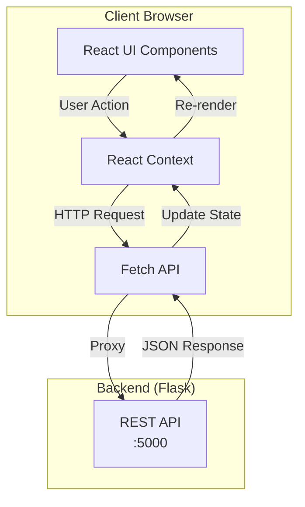
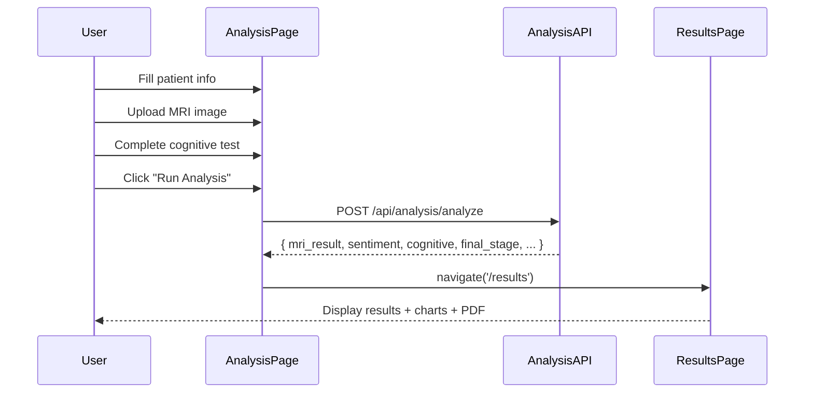

# NeuroSense AI — Frontend

> React Single Page Application for Clinical Decision Support

[](https://react.dev/)
[](https://vitejs.dev/)
[](https://tailwindcss.com/)

---

## Overview

The NeuroSense frontend is a **React-based Single Page Application (SPA)** that provides the user interface for healthcare professionals to interact with the multimodal AI system.

**Key Principles:**
- Feature-based architecture
- Component reusability
- Responsive design
- Smooth animations

---

## 🧠 Feature Interaction Flow



### Analysis Flow



---

## Technology Stack

| Category | Technology |
|----------|------------|
| Framework | React 19.x |
| Build Tool | Vite 6.x |
| Styling | Tailwind CSS 3.x |
| Animations | Framer Motion 12.x |
| Charts | Recharts 3.x |
| Routing | React Router DOM 7.x |
| Icons | Lucide React |
| HTTP | Native Fetch API |
| State | React Context |

---

## Folder Structure

```
frontend/src/
├── features/                    # Feature-based modules
│   ├── auth/                   # Authentication
│   │   ├── LoginPage.jsx       # Login UI
│   │   ├── api/authApi.js      # API calls
│   │   └── AuthProvider.jsx    # Auth context
│   │
│   ├── analysis/               # Assessment wizard
│   │   ├── AnalysisPage.jsx    # Main wizard
│   │   ├── api/analysisApi.js  # API calls
│   │   ├── hooks/useAnalysis.js
│   │   └── components/         # Step components
│   │       ├── PatientStep.jsx
│   │       ├── MRIStep.jsx
│   │       ├── CognitiveStep.jsx
│   │       ├── HandwritingStep.jsx
│   │       ├── SpeechStep.jsx
│   │       └── RiskStep.jsx
│   │
│   ├── patients/               # Patient management
│   │   ├── PatientsPage.jsx    # Patient list UI
│   │   ├── api/patientsApi.js # API calls
│   │   └── hooks/usePatients.js
│   │
│   ├── history/                # Trend visualization
│   │   ├── HistoryPage.jsx     # Charts & history
│   │   ├── api/historyApi.js  # API calls
│   │   └── hooks/useHistory.js
│   │
│   ├── results/                # Analysis results
│   │   ├── ResultsPage.jsx     # Results display
│   │   ├── api/resultsApi.js  # API calls
│   │   └── components/         # Result sections
│   │       ├── MRIResults.jsx
│   │       ├── AssessmentResults.jsx
│   │       ├── ProfileResults.jsx
│   │       └── MusicRecommendations.jsx
│   │
│   └── dashboard/              # Dashboard
│       └── DashboardPage.jsx
│
├── components/                 # Reusable UI components
│   ├── ui/                     # Base UI components
│   │   ├── Button.jsx
│   │   ├── GlassCard.jsx
│   │   ├── Modal.jsx
│   │   ├── PageLoader.jsx
│   │   ├── ProgressBar.jsx
│   │   ├── DropZone.jsx
│   │   └── Skeleton.jsx
│   │
│   └── layout/                 # Layout components
│       ├── AppLayout.jsx       # Main layout wrapper
│       ├── Sidebar.jsx         # Navigation sidebar
│       └── TopBar.jsx          # Header
│
├── context/                    # React context providers
│   ├── AuthContext.jsx         # Authentication state
│   └── ResultsStore.jsx        # Analysis results state
│
├── App.jsx                     # Root component & routing
├── main.jsx                    # Entry point
└── index.css                   # Global styles
```

---

## 🛠️ How to Add a New Feature

Here's a step-by-step guide for adding a new feature (e.g., Sleep Analysis):

### Step 1: Create the Feature Directory
```
src/features/sleep/
├── SleepPage.jsx
├── api/sleepApi.js
└── hooks/useSleep.js
```

### Step 2: Create the API Module
```javascript
// features/sleep/api/sleepApi.js
const API_BASE = ''

export const sleepApi = {
  analyze: async (data) => {
    const res = await fetch(`${API_BASE}/api/analysis/sleep`, {
      method: 'POST',
      headers: { 'Content-Type': 'application/json' },
      credentials: 'include',
      body: JSON.stringify(data),
    })
    return res.json()
  },
}
```

### Step 3: Create the Page Component
```jsx
// features/sleep/SleepPage.jsx
import { sleepApi } from './api/sleepApi'

export default function SleepPage() {
  const handleAnalyze = async () => {
    const result = await sleepApi.analyze({ ... })
    // Handle result
  }
  
  return (
    <GlassCard>
      <h1>Sleep Analysis</h1>
      {/* Form components */}
    </GlassCard>
  )
}
```

### Step 4: Add Custom Hook (Optional)
```javascript
// features/sleep/hooks/useSleep.js
import { useState } from 'react'
import { sleepApi } from '../api/sleepApi'

export function useSleep() {
  const [loading, setLoading] = useState(false)
  
  const analyze = async (data) => {
    setLoading(true)
    try {
      return await sleepApi.analyze(data)
    } finally {
      setLoading(false)
    }
  }
  
  return { loading, analyze }
}
```

### Step 5: Register the Route
```jsx
// App.jsx
import SleepPage from './features/sleep/SleepPage'

<Route path="sleep" element={<PageTransition><SleepPage /></PageTransition>} />
```

### Step 6: Add Navigation
```jsx
// components/layout/Sidebar.jsx
<NavLink to="/sleep">Sleep Analysis</NavLink>
```

---

## Features

### 1. Authentication

- **Login Page** — User credentials entry
- **Session Management** — Protected routes with auth context
- **Auto-logout** — Session expiration handling

### 2. Analysis Wizard

Multi-step assessment wizard with 6 stages:

| Step | Description | Input |
|------|-------------|-------|
| 1. Patient Info | Demographics & patient ID | Form |
| 2. MRI Scan | Brain MRI upload | Image file |
| 3. Cognitive Test | MMSE-based questions | Form |
| 4. Handwriting | Drawing analysis | Image/Canvas |
| 5. Speech | Voice recording | Audio file |
| 6. Risk Factors | Lifestyle & family history | Form |

### 3. Patient Management

- **List View** — All patients with search
- **Add Patient** — Create new patient record
- **Edit/Delete** — CRUD operations
- **Export** — CSV download

### 4. Results Display

- **MRI Results** — Classification + Grad-CAM visualization
- **Assessment Scores** — Cognitive, sentiment, risk scores
- **Profile Comparison** — Radar/spider charts
- **Music Recommendations** — Personalized playlists
- **PDF Report** — Downloadable summary

### 5. History & Trends

- **Session History** — Past analyses per patient
- **Trend Charts** — Line charts for progression
- **Export** — CSV download

### 6. Dashboard

- **Quick Stats** — Patient count, recent analyses
- **Recent Activity** — Latest sessions
- **Navigation** — Quick links to features

---

## Running the Frontend

### Prerequisites

| Tool | Version |
|------|---------|
| Node.js | 18+ |
| npm | 9+ |

### Quick Start

```bash
# Navigate to frontend directory
cd frontend

# Install dependencies
npm install

# Run development server
npm run dev
```

The frontend runs at **http://127.0.0.1:3000**

### Build for Production

```bash
# Create production build
npm run build

# Preview production build
npm run preview
```

---

## API Integration

### Base Configuration

The frontend communicates with the backend via the Vite proxy (configured in `vite.config.js`):

```javascript
// vite.config.js
export default defineConfig({
  server: {
    port: 3000,
    proxy: {
      '/api': {
        target: 'http://localhost:5000',
        changeOrigin: true,
      },
    },
  },
})
```

### API Clients

All API calls are centralized in feature-specific modules:

| Feature | API Module |
|---------|------------|
| Auth | `features/auth/api/authApi.js` |
| Analysis | `features/analysis/api/analysisApi.js` |
| Patients | `features/patients/api/patientsApi.js` |
| History | `features/history/api/historyApi.js` |
| Results | `features/results/api/resultsApi.js` |

### Example: Auth API

```javascript
// features/auth/api/authApi.js
export const authApi = {
  login: async (username, password) => {
    const res = await fetch('/api/auth/login', {
      method: 'POST',
      headers: { 'Content-Type': 'application/json' },
      credentials: 'include',
      body: JSON.stringify({ username, password }),
    })
    return res.json()
  },
  // ... register, logout, getCurrentUser
}
```

### Authentication State

```javascript
// context/AuthContext.jsx
const { user, loading, login, register, logout } = useAuth()

// Protected route example
if (loading) return <PageLoader />
return user ? <Dashboard /> : <Navigate to="/login" />
```

---

## UI Components

### Glass Card

Reusable card with glassmorphism effect:

```jsx
<GlassCard>
  <h3>Patient Data</h3>
  <p>Content goes here</p>
</GlassCard>
```

### Button

Primary action button:

```jsx
<Button variant="primary" onClick={handleSubmit}>
  Run Analysis
</Button>
```

### Modal

Dialog component:

```jsx
<Modal isOpen={isOpen} onClose={() => setIsOpen(false)}>
  <h2>Confirm Action</h2>
</Modal>
```

---

## Styling

### Design System

The UI uses a custom design system defined in `index.css`:

```css
:root {
  --primary: #6366f1;
  --secondary: #06b6d4;
  --accent: #a855f7;
  --bg: #0a0e1a;
  --surface: #1e293b;
}
```

### Tailwind Configuration

Custom colors and fonts in `tailwind.config.js`:

```javascript
export default {
  content: ['./index.html', './src/**/*.{js,ts,jsx,tsx}'],
  theme: {
    extend: {
      colors: {
        primary: '#6366f1',
        secondary: '#06b6d4',
      },
      fontFamily: {
        sans: ['Inter', 'system-ui'],
        display: ['Space Grotesk', 'sans-serif'],
        mono: ['JetBrains Mono', 'monospace'],
      },
    },
  },
  plugins: [],
}
```

### Animations

Framer Motion is used for page transitions and micro-interactions:

```jsx
<motion.div
  initial={{ opacity: 0, y: 12 }}
  animate={{ opacity: 1, y: 0 }}
  transition={{ duration: 0.35 }}
>
  {children}
</motion.div>
```

---

## Routing

Routes are defined in `App.jsx`:

```jsx
<Routes>
  <Route path="/login" element={<LoginPage />} />
  <Route path="/" element={<ProtectedRoute><AppLayout /></ProtectedRoute>}>
    <Route index element={<Navigate to="/dashboard" />} />
    <Route path="dashboard" element={<DashboardPage />} />
    <Route path="analysis" element={<AnalysisPage />} />
    <Route path="patients" element={<PatientsPage />} />
    <Route path="history/:patientId" element={<HistoryPage />} />
    <Route path="results" element={<ResultsPage />} />
  </Route>
</Routes>
```

---

## State Management

### Auth Context

```jsx
// Provides: user, loading, login, register, logout
<AuthProvider>
  <App />
</AuthProvider>
```

### Results Store

```jsx
// Store analysis results across pages
setAnalysisResults(data)
const results = useAnalysisResults()
```

---

## Build & Deployment

### Development

```bash
npm run dev     # Start dev server with HMR
npm run lint    # Run ESLint
```

### Production

```bash
npm run build   # Build for production
npm run preview # Preview production build
```

### Output

Production build is generated in `frontend/dist/`:

```
dist/
├── index.html
├── assets/
│   ├── index-[hash].js
│   ├── index-[hash].css
│   └── ...
```

---

## Browser Support

| Browser | Version |
|---------|---------|
| Chrome | 90+ |
| Firefox | 88+ |
| Safari | 14+ |
| Edge | 90+ |

---

## Environment Variables

No frontend-specific environment variables are required. All configuration is handled through the Vite proxy.

---

## Production Readiness

| Feature | Status | Implementation |
|---------|--------|----------------|
| Build Tool | ✅ | Vite 6.x with optimized bundles |
| Code Splitting | ✅ | React.lazy + Suspense |
| CSS Optimizations | ✅ | Tailwind + PostCSS |
| Error Boundaries | ✅ | React error boundaries |
| Loading States | ✅ | Skeleton + progress components |
| Proxy Config | ✅ | vite.config.js |

---

## Future Improvements

- [ ] Add TypeScript for type safety
- [ ] Implement React Query for server state
- [ ] Add unit tests with Vitest/Testing Library
- [ ] Dark/Light theme toggle
- [ ] Mobile-responsive sidebar
- [ ] Progressive Web App (PWA) support

---

## Dependencies

### Production

```json
{
  "framer-motion": "^12.38.0",
  "lucide-react": "^1.0.1",
  "react": "^19.2.4",
  "react-dom": "^19.2.4",
  "react-dropzone": "^15.0.0",
  "react-hot-toast": "^2.6.0",
  "react-router-dom": "^7.13.2",
  "recharts": "^3.8.0"
}
```

### Development

```json
{
  "@vitejs/plugin-react": "^4.7.0",
  "autoprefixer": "^10.4.27",
  "eslint": "^9.39.4",
  "postcss": "^8.5.8",
  "tailwindcss": "^3.4.19",
  "vite": "^6.4.1"
}
```
