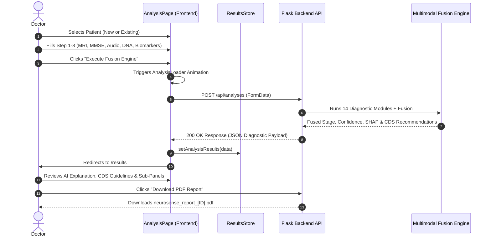
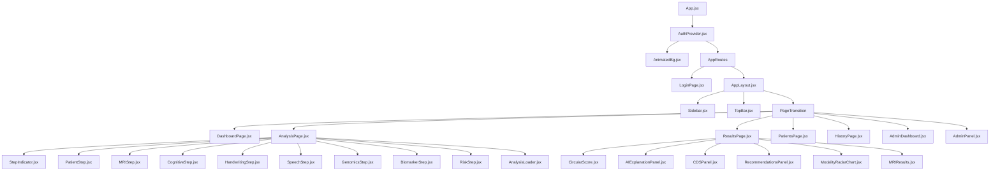

# 🧠 NeuroSense AI - Frontend Master Technical Manual & Architectural Specification

> **Single Source of Truth** for the NeuroSense AI Clinical Frontend Application.  
> Reverse-engineered from source code to serve as complete documentation for Developers, Senior Architects, UX Analysts, Backend Engineers, QA Leads, and AI Agents.

---

## 📑 Table of Contents
1. [Project Overview](#1-project-overview)
2. [Complete Folder Tree](#2-complete-folder-tree)
3. [Folder Structure Explanation](#3-folder-structure-explanation)
4. [Routing Specification](#4-routing-specification)
5. [Navigation Flow & Sequence Diagrams](#5-navigation-flow--sequence-diagrams)
6. [Screen Documentation](#6-screen-documentation)
7. [Comprehensive Button Directory](#7-comprehensive-button-directory)
8. [Form Specifications](#8-form-specifications)
9. [Input Controls Directory](#9-input-controls-directory)
10. [Modal Dialogs Directory](#10-modal-dialogs-directory)
11. [Data Tables Directory](#11-data-tables-directory)
12. [Cards & Containers Directory](#12-cards--containers-directory)
13. [Charts & Visualizations Directory](#13-charts--visualizations-directory)
14. [Complete Component Tree & Diagrams](#14-complete-component-tree--diagrams)
15. [State Management Architecture](#15-state-management-architecture)
16. [API Interface Documentation](#16-api-interface-documentation)
17. [Authentication & Session Flow](#17-authentication--session-flow)
18. [User Roles & Permissions Matrix](#18-user-roles--permissions-matrix)
19. [Step-by-Step Frontend Workflow](#19-step-by-step-frontend-workflow)
20. [Animation & Micro-Interactions](#20-animation--micro-interactions)
21. [Error Handling & Notification System](#21-error-handling--notification-system)
22. [File Upload Engine & Pipeline](#22-file-upload-engine--pipeline)
23. [Responsive Layout & Breakpoint System](#23-responsive-layout--breakpoint-system)
24. [Reusable UI Components Library](#24-reusable-ui-components-library)
25. [Custom Hooks Directory](#25-custom-hooks-directory)
26. [Utility Helpers & Configs](#26-utility-helpers--configs)
27. [Environment Variables](#27-environment-variables)
28. [Dependency Manifest & Rationale](#28-dependency-manifest--rationale)
29. [Developer Maintenance & Onboarding Guide](#29-developer-maintenance--onboarding-guide)

---

## 1. Project Overview

### 1.1 Executive Summary
**NeuroSense AI** is a state-of-the-art multimodal Clinical Decision Support (CDS) platform designed for early detection, differential stage classification, and monitoring of Alzheimer's Disease (AD) and related cognitive disorders. 

The frontend application provides clinicians and healthcare administrators with an intuitive, glassmorphic UI. It aggregates data from 14 analytical modules—including T1-weighted structural MRI scans, neuropsychological tests (MMSE/MoCA), acoustic/speech transcript sentiment, neuromotor handwriting kinematics, plasma biomarkers, genomic variants, and clinical risk factors—to synthesize unified diagnostic stage predictions and personalized care plans.

### 1.2 Purpose & Target Users
- **Primary Users (Doctors/Clinicians)**: Conduct patient intakes, submit multimodal diagnostic evidence, review AI explanations (SHAP/LIME), receive Clinical Decision Support guidelines, track cognitive trajectories over time, and export downloadable PDF patient reports.
- **Secondary Users (System Administrators)**: Monitor system-wide diagnostic statistics, manage registered doctor and patient accounts, track live ML model/database server health, and perform maintenance tasks.
- **Business Goal**: Accelerate early-stage Alzheimer's diagnosis, minimize clinical evaluation latency, standardize multimodal evidence synthesis, and provide interpretable AI insights to reduce diagnostic error.

### 1.3 Technology Stack
- **Core Engine**: React 18 + Vite
- **Routing**: React Router DOM v6 with lazy loading (`React.lazy`, `Suspense`) and layout nesting.
- **State & Context**: React Context API (`AuthProvider` for RBAC, `ResultsStore` for diagnostic payload management).
- **Styling**: Custom CSS design system (`index.css`), glassmorphic design tokens, dark-mode color palette, Tailwind CSS utilities.
- **Animations**: Framer Motion (`AnimatePresence`, spring transitions, gesture interactions).
- **Data Visualization**: Recharts (Area charts, Line graphs, Radar charts, Pie/Donut charts) & HTML5 Canvas API.
- **Icons**: Lucide React.
- **Feedback**: React Hot Toast.

---

## 2. Complete Folder Tree

```
frontend/
├── index.html
├── package.json
├── vite.config.js
├── tailwind.config.js
├── postcss.config.js
└── src/
    ├── main.jsx
    ├── App.jsx
    ├── index.css
    ├── config/
    │   └── api.js
    ├── context/
    │   └── ResultsStore.js
    ├── providers/
    │   └── QueryProvider.jsx
    ├── components/
    │   ├── AnimatedBg.jsx
    │   ├── layout/
    │   │   ├── AppLayout.jsx
    │   │   ├── Sidebar.jsx
    │   │   └── TopBar.jsx
    │   └── ui/
    │       ├── Button.jsx
    │       ├── CircularScore.jsx
    │       ├── DropZone.jsx
    │       ├── GlassCard.jsx
    │       ├── Modal.jsx
    │       ├── PageLoader.jsx
    │       ├── ProgressBar.jsx
    │       └── Skeleton.jsx
    └── features/
        ├── index.js
        ├── admin/
        │   ├── AdminDashboard.jsx
        │   └── AdminPanel.jsx
        ├── analysis/
        │   ├── AnalysisPage.jsx
        │   ├── index.js
        │   ├── api/
        │   │   └── analysisApi.js
        │   ├── components/
        │   │   ├── AnalysisLoader.jsx
        │   │   ├── BiomarkerStep.jsx
        │   │   ├── CognitiveStep.jsx
        │   │   ├── GenomicsStep.jsx
        │   │   ├── HandwritingStep.jsx
        │   │   ├── MRIStep.jsx
        │   │   ├── PatientStep.jsx
        │   │   ├── RiskStep.jsx
        │   │   ├── SharedComponents.jsx
        │   │   ├── SpeechStep.jsx
        │   │   └── StepIndicator.jsx
        │   └── hooks/
        │       └── useAnalysis.js
        ├── auth/
        │   ├── AuthProvider.jsx
        │   ├── LoginPage.jsx
        │   ├── index.js
        │   └── api/
        │       └── authApi.js
        ├── dashboard/
        │   ├── DashboardPage.jsx
        │   └── index.js
        ├── history/
        │   ├── HistoryPage.jsx
        │   ├── index.js
        │   ├── api/
        │   │   └── historyApi.js
        │   └── hooks/
        │       └── useHistory.js
        ├── patients/
        │   ├── PatientsPage.jsx
        │   ├── index.js
        │   ├── api/
        │   │   └── patientsApi.js
        │   └── hooks/
        │       └── usePatients.js
        └── results/
            ├── ResultsPage.jsx
            ├── index.js
            ├── api/
            │   └── resultsApi.js
            └── components/
                ├── AIExplanationPanel.jsx
                ├── AssessmentResults.jsx
                ├── CDSPanel.jsx
                ├── ModalityRadarChart.jsx
                ├── MRIResults.jsx
                ├── MusicRecommendations.jsx
                ├── ProfileResults.jsx
                ├── RecommendationsPanel.jsx
                └── ResultSection.jsx
```

---

## 3. Folder Structure Explanation

- **`src/config/`**: Central configuration files. `api.js` resolves the HTTP backend URL dynamically from `import.meta.env.VITE_API_URL` or defaults to `http://localhost:10000`.
- **`src/context/`**: Global state containers independent of React components. `ResultsStore.js` retains diagnostic payloads across page transitions without relying on URL parameters.
- **`src/providers/`**: Top-level application providers. `QueryProvider.jsx` sets up React Query client options.
- **`src/components/layout/`**: Core shell components. `AppLayout.jsx` orchestrates responsive layout, collapsible `Sidebar.jsx`, and sticky `TopBar.jsx`.
- **`src/components/ui/`**: Reusable visual primitive components implementing the Glassmorphism design system (`GlassCard`, `Button`, `Modal`, `DropZone`, `ProgressBar`, `Skeleton`).
- **`src/features/`**: Modular domain-driven feature folders. Each feature directory encapsulating components, API services, hooks, and views:
  - **`auth/`**: Authentication state (`AuthProvider`), login screen (`LoginPage`), and API client (`authApi.js`).
  - **`dashboard/`**: Clinician high-level overview (`DashboardPage`).
  - **`analysis/`**: 8-step diagnostic wizard (`AnalysisPage`), progress loader (`AnalysisLoader`), sub-step forms (`*Step.jsx`), and execution API (`analysisApi.js`).
  - **`results/`**: Diagnostic output report (`ResultsPage`) and 10 detailed clinical sub-panels (`CDSPanel`, `AIExplanationPanel`, `MRIResults`, etc.).
  - **`patients/`**: Patient registry directory (`PatientsPage`), filter engine, registration modal, and API (`patientsApi.js`).
  - **`history/`**: Patient cognitive trajectory tracking (`HistoryPage`) and API (`historyApi.js`).
  - **`admin/`**: System administrative screens (`AdminDashboard`, `AdminPanel`).

---

## 4. Routing Specification

Routing is declared in `src/App.jsx` using `react-router-dom` v6 with lazy-loaded chunking via `React.lazy()` and `Suspense`.

```mermaid
graph TD
    A[Root Route /] --> B{Authenticated?}
    B -- No --> C[/login]
    B -- Yes --> D{Is Admin?}
    D -- Yes --> E[/admin/dashboard]
    D -- No --> F[/dashboard]
    
    SubGraph Doctor Routes
        F --> G[/analysis]
        F --> H[/patients]
        F --> I[/results]
        F --> J[/history/:patientId]
    end
    
    SubGraph Admin Routes
        E --> K[/admin/panel]
    end
```

| Route URL | Component | Purpose | Access Level | Navigation Source | Navigation Destination | Protected / Public | Required State | API Calls |
| :--- | :--- | :--- | :--- | :--- | :--- | :--- | :--- | :--- |
| `/login` | `LoginPage` | User & Admin sign-in / registration / password reset | Public | Direct URL / Redirect from protected routes | `/dashboard` or `/admin/dashboard` | Public | None | `POST /api/auth/login`, `POST /api/auth/register`, `POST /api/auth/forgot-password` |
| `/` | `RoleRedirect` | Automatic root path dispatcher based on role | Authenticated | Direct URL root `/` | `/dashboard` (Doctor) or `/admin/dashboard` (Admin) | Protected | `user` object in AuthContext | None |
| `/dashboard` | `DashboardPage` | Clinical overview, stats, trends, priority reviews | Doctor / Admin | Sidebar / Nav link / `/login` success | `/analysis`, `/results`, `/patients`, `/history/:id` | Protected | Authenticated Doctor session | `GET /api/patients`, `GET /api/analyses` |
| `/analysis` | `AnalysisPage` | 8-Step Multimodal Diagnostic Intake Pipeline | Doctor / Admin | Sidebar / Dashboard "New Analysis" | `/results` | Protected | Active form state in `AnalysisPage` | `GET /api/patients`, `POST /api/analyses` |
| `/results` | `ResultsPage` | Diagnostic report, AI explanation, CDS guidelines | Doctor / Admin | `/analysis` completion / Dashboard "View Reports" | `/analysis` | Protected | `getAnalysisResults()` payload in `ResultsStore` | `POST /api/analyses/report/pdf` |
| `/patients` | `PatientsPage` | Patient registry directory, search, filter, register | Doctor / Admin | Sidebar / Dashboard quick tiles | `/history/:patientId` | Protected | Authenticated session | `GET /api/patients`, `GET /api/analyses`, `POST /api/patients` |
| `/history/:patientId` | `HistoryPage` | Longitudinal progression tracking and session logs | Doctor / Admin | Patient table row / Dashboard recent analysis card | `/patients` | Protected | `patientId` URL parameter | `GET /api/patients/history/:patientId`, `GET /api/patients/export/:patientId` |
| `/admin` | Layout Wrapper | Redirects `/admin` index to `/admin/dashboard` | Admin Only | Sidebar / Direct URL | `/admin/dashboard` | Protected (Admin) | `user.role === 'admin'` | None |
| `/admin/dashboard` | `AdminDashboard` | System metrics, stage distributions, server status | Admin Only | Sidebar / Admin panel link | `/admin/panel` | Protected (Admin) | Authenticated Admin session | `GET /api/admin/dashboard`, `GET /api/health` |
| `/admin/panel` | `AdminPanel` | User & patient management, deletion controls | Admin Only | Admin Dashboard "Admin Panel" button | `/admin/dashboard` | Protected (Admin) | Authenticated Admin session | `GET /api/admin/doctors`, `GET /api/admin/patients`, `DELETE /api/admin/doctors/:id`, `DELETE /api/admin/patients/:id` |
| `*` | Redirect | Wildcard fallback catch-all | Any | Invalid URL entry | `/dashboard` | Public | None | None |

---

## 5. Navigation Flow & Sequence Diagrams

### 5.1 End-to-End Diagnostic Sequence


```mermaid
sequenceDiagram
    autonumber
    actor Doctor
    participant UI as AnalysisPage (Frontend)
    participant Store as ResultsStore
    participant API as Flask Backend API
    participant Engine as Multimodal Fusion Engine

    Doctor->>UI: Selects Patient (New or Existing)
    Doctor->>UI: Fills Step 1-8 (MRI, MMSE, Audio, DNA, Biomarkers)
    Doctor->>UI: Clicks "Execute Fusion Engine"
    UI->>UI: Triggers AnalysisLoader Animation
    UI->>API: POST /api/analyses (FormData)
    API->>Engine: Runs 14 Diagnostic Modules + Fusion
    Engine-->>API: Fused Stage, Confidence, SHAP & CDS Recommendations
    API-->>UI: 200 OK Response (JSON Diagnostic Payload)
    UI->>Store: setAnalysisResults(data)
    UI->>Doctor: Redirects to /results
    Doctor->>UI: Reviews AI Explanation, CDS Guidelines & Sub-Panels
    Doctor->>API: Clicks "Download PDF Report"
    API-->>Doctor: Downloads neurosense_report_[ID].pdf
```

---

## 6. Screen Documentation

### 6.1 Authentication Screen (`LoginPage.jsx`)
- **Purpose**: Authenticates clinicians and admins, registers new user accounts, and processes password reset requests.
- **UI Layout**: Centered glassmorphic card on top of an interactive canvas backdrop (`AnimatedBg`).
- **Cards**: Glass Card container with dual navigation tabs and conditional panel views.
- **Sub-Views**:
  1. **Sign In View**: Doctor & Admin login form. Contains email and password fields.
  2. **Register View**: Name, email, password, and role selector dropdown (Doctor vs Admin).
  3. **Admin Access View**: Admin email, password, and security passkey input.
  4. **Forgot Password View**: Email input for password reset email request.
- **Header Actions**: Quick demo login buttons (*Doctor Login* and *Admin Login*).

### 6.2 Doctor Clinical Dashboard (`DashboardPage.jsx`)
- **Purpose**: Central command center displaying patient volume, high-risk flags, monthly diagnostic trends, and recent analysis runs.
- **UI Layout**: Responsive grid layout (4 stat cards top, 2 large chart panels middle, 2 activity list panels bottom, 4 quick action tiles footer).
- **Stat Cards**:
  - `Total Patients`: Displays total count with cyan icon.
  - `Total Analyses`: Displays completed multimodal runs with indigo icon.
  - `High Risk`: Red icon with alert badge when count > 0.
  - `Today's Activity`: Counts analyses run in the last 24 hours with green activity icon.
- **Charts**:
  - `Detection Trends`: Area chart showing 7-month distribution across Normal, Mild, and Moderate stages.
  - `Stage Distribution`: Donut chart showing overall share per stage.
- **Lists**:
  - `Recent Analyses`: 5 most recent runs with initials avatar, patient name, stage, confidence, and timestamp.
  - `Priority Review`: High-risk cases flagged for urgent follow-up.

### 6.3 Multimodal Diagnostic Intake (`AnalysisPage.jsx`)
- **Purpose**: 8-step interactive diagnostic intake wizard aggregating data from 14 modules.
- **Header Tools**: *Load Sample Case* button (pre-fills Eleanor Vance test case) and *Patient Selector* radio group.
- **Step Wizard Breakdown**:
  - **Step 1 (Patient Intake)**: Demographics, ID, Age, Sex, Education, Clinical notes, Photo upload.
  - **Step 2 (MRI Scan)**: T1-weighted structural MRI scan drag-and-drop file uploader (`.nii`, `.dcm`, `.png`, `.jpg`).
  - **Step 3 (Cognitive Test)**: MMSE score (0-30), MoCA score (0-30), Delayed recall (0-10), Clock Drawing (0-5).
  - **Step 4 (Handwriting)**: Dual-mode input—interactive drawing pad (HTML5 Canvas) or file uploader.
  - **Step 5 (Speech Analysis)**: Audio file upload (`.wav`, `.mp3`) or direct transcript text input.
  - **Step 6 (Genomics)**: FASTA/VCF file upload or APOE gene variant text input.
  - **Step 7 (Biomarkers)**: Plasma p-tau181, Aβ42/Aβ40 ratio, NfL, and GFAP numeric inputs.
  - **Step 8 (Clinical Risk)**: Cardiovascular toggles, family history checkbox, activity level select, sleep hours.
- **Footer Bar**: Navigation buttons (*Back*, *Step Indicator Dots*, *Next Step*, *Execute Fusion Engine*).

### 6.4 Diagnostic Results Report (`ResultsPage.jsx`)
- **Purpose**: Displays fused diagnostic output, composite risk index score, confidence level, AI explanations, Clinical Decision Support recommendations, and PDF export.
- **Header**: Patient information badge, *Download PDF* action button, and *New Analysis* button.
- **Composite Score Dial**: Circular gauge (0-100 score), diagnostic stage label, animated confidence progress bar, and 6-axis Radar Chart preview.
- **Integrated Panels**:
  1. `AIExplanationPanel`: SHAP/LIME feature rankings and diagnostic explanations.
  2. `CDSPanel`: Clinical Decision Support differential diagnosis and stage guidelines.
  3. `RecommendationsPanel`: Actionable pharmacological, lifestyle, and follow-up advice.
  4. `ModalityRadarChart`: Expanded multi-modality confidence visualization.
  5. `MRIResults`: Structural MRI slice previews and hippocampal metrics.
  6. `CognitiveResults`: Cognitive sub-test scores vs normative standards.
  7. `SentimentResults`: Acoustic speech pause frequency and linguistic sentiment.
  8. `HandwritingResults`: Kinematic motor speed, pressure variance, and tremor risk score.
  9. `RiskProfileResults`: Modifiable vs non-modifiable risk contribution matrix.
  10. `MusicRecommendations`: Auditory stimulation playlist suggestions.

### 6.5 Patient Registry (`PatientsPage.jsx`)
- **Purpose**: Searchable patient table with risk filtering, date/name sorting, export tools, and patient creation modal.
- **Controls**: Search input text, Risk level filter select (*All Risks*, *Normal*, *Mild*, *High Risk*), Sorting toggle buttons (*Date*, *Name*).
- **Table Columns**: Patient ID, Name + Avatar, Age, Risk Badge, Last Analysis Date, Actions (*View History*, *Export Data*).
- **Add Patient Modal**: Form inputs for ID, Name, Age, Education, Sex, Notes.

### 6.6 Patient History (`HistoryPage.jsx`)
- **Purpose**: Longitudinal trajectory graph tracking cognitive scores and stage changes across multiple session dates for a patient.
- **Metrics Bar**: First stage recorded, current stage, average model confidence.
- **Charts**:
  - `Progress Area Chart`: Stage score trajectory over time.
  - `Detailed Metrics Line Chart`: Multi-line tracking of MRI confidence, Cognitive score, and Health index across sessions.
- **Session Cards**: Expandable card list displaying date, stage badge, confidence bar, and individual sub-scores.

### 6.7 Admin Dashboard (`AdminDashboard.jsx`)
- **Purpose**: System-wide administrative overview for server monitors, global stage distributions, and user counts.
- **Stat Cards**: Total Users, Registered Doctors, Total Patients, Fused Analyses.
- **Stage Distribution Bars**: Visual percentage progress bars per dementia stage across all system records.
- **System Health Monitor**: Live operational badges for API Server, Database, and ML Models.

### 6.8 Admin Panel (`AdminPanel.jsx`)
- **Purpose**: Management console for administrative data cleanup and user deletion.
- **Navigation Tabs**: Doctors Tab, Patients Tab, Analyses Tab.
- **Search Bar**: Global search input filtering table entities.
- **Action Tables**: Lists entity cards with red *Delete* action buttons triggering confirmation prompts.

---

## 7. Comprehensive Button Directory

| Button Name | Screen Location | Visual Style / Color | Visible Condition | Action on Click | Validation | API Endpoint | Toast Feedback |
| :--- | :--- | :--- | :--- | :--- | :--- | :--- | :--- |
| **Doctor Login (Quick Access)** | `LoginPage` Header | Secondary Glass (Indigo glow) | Always on `/login` | Auto-fills `doctor@neurosense.ai` and logs in | None | `POST /api/auth/login` | "Logged in as Doctor" |
| **Admin Login (Quick Access)** | `LoginPage` Header | Secondary Glass (Purple glow) | Always on `/login` | Auto-fills `admin@neurosense.ai` and logs in | None | `POST /api/auth/login` | "Logged in as Admin" |
| **Sign In** | `LoginPage` Form | Gradient Primary (Indigo to Purple) | On Sign In tab | Submits email & password | Email format & Non-empty password | `POST /api/auth/login` | "Welcome back!" / Error message |
| **Create Account** | `LoginPage` Form | Gradient Primary | On Register tab | Submits new doctor/admin account | Password length ≥ 6 | `POST /api/auth/register` | "Account created successfully!" |
| **Authenticate Admin** | `LoginPage` Form | Red Gradient | On Admin tab | Authenticates admin credentials & passkey | Valid passkey | `POST /api/auth/login` | "Admin access granted" |
| **Send Reset Link** | `LoginPage` Form | Primary Indigo | On Forgot Password view | Sends password reset email | Non-empty email | `POST /api/auth/forgot-password` | "Reset link sent to email" |
| **New Analysis** | `DashboardPage` Header | Primary Indigo | Always | Navigates to `/analysis` | Authenticated session | None | None |
| **View Reports** | `DashboardPage` Header | Glass Secondary | Always | Navigates to `/results` | Authenticated session | None | None |
| **Load Sample Case** | `AnalysisPage` Header | Glass Purple with Sparkles | Step 0 of Intake | Pre-fills form with Eleanor Vance patient data | None | None | "Loaded Clinical Evaluation Sample Case!" |
| **Change Patient** | `AnalysisPage` Sub-header | Text Link (Indigo) | Step > 0 | Resets intake step back to Step 0 | None | None | None |
| **Clear Canvas** | `HandwritingStep` | Secondary Ghost | Draw mode selected | Clears HTML5 drawing canvas | Active drawing | None | None |
| **Undo Stroke** | `HandwritingStep` | Secondary Ghost | Draw mode selected | Reverts last drawing path | Path history > 0 | None | None |
| **Back** | `AnalysisPage` Footer | Secondary Ghost | Step > 0 | Decrements step index (`step - 1`) | Step > 0 | None | None |
| **Next Step** | `AnalysisPage` Footer | Gradient Primary | Step < 7 | Increments step index (`step + 1`) | None | None | None |
| **Execute Fusion Engine** | `AnalysisPage` Footer | Primary Indigo (Pulse) | Step == 7 | Submits FormData to analysis API | Patient ID & Name required | `POST /api/analyses` | "Executing Multimodal Fusion Engine…" -> "Diagnostic evaluation complete!" |
| **Download PDF** | `ResultsPage` Header | Secondary Glass (Cyan border) | Results payload exists | Triggers browser download of PDF report | Valid results payload | `POST /api/analyses/report/pdf` | "PDF report downloaded successfully!" |
| **Add Patient** | `PatientsPage` Header | Primary Indigo | Always | Opens Add Patient Modal | Authenticated session | None | None |
| **View History (Eye Icon)** | `PatientsPage` Table | Icon Button (Indigo glass) | Table row rendered | Navigates to `/history/:patient_id` | Valid patient ID | None | None |
| **Export Data (Download Icon)**| `PatientsPage` Table | Icon Button (Cyan glass) | Table row rendered | Triggers CSV/JSON download in new tab | Valid patient ID | `GET /api/patients/export/:id` | None |
| **Delete Doctor** | `AdminPanel` Row | Red Icon Button (Trash) | Doctors tab active | Deletes doctor user record | Confirmation dialog accepted | `DELETE /api/admin/doctors/:id` | "Doctor deleted" |
| **Delete Patient** | `AdminPanel` Row | Red Icon Button (Trash) | Patients tab active | Deletes patient record | Confirmation dialog accepted | `DELETE /api/admin/patients/:id` | "Patient deleted" |

---

## 8. Form Specifications

### 8.1 Patient Intake Form (`PatientStep.jsx`)
- **Fields**: `patient_id` (Text), `name` (Text), `age` (Number), `sex` (Radio Buttons: M/F/Other), `education_years` (Number), `notes` (Textarea), `photo` (File Upload).
- **Validation**: `patient_id` and `name` are mandatory. Form submit blocks if missing.
- **Default Values**: `{ patient_id: '', name: '', age: '', sex: 'M', education_years: '', photo: null }`.

### 8.2 Cognitive Sub-Battery Form (`CognitiveStep.jsx`)
- **Fields**: `mmse` (0-30), `moca` (0-30), `memory_recall` (0-10), `clock_draw` (0-5).
- **Validation**: Numerical min/max clamping enforced on blur.

### 8.3 Fluid Biomarkers Panel Form (`BiomarkerStep.jsx`)
- **Fields**: `p_tau181` (pg/mL), `abeta_ratio` (ratio), `nfl` (pg/mL), `gfap` (pg/mL).
- **Validation**: Accepts positive floating point numbers.

### 8.4 Clinical Risk Profile Form (`RiskStep.jsx`)
- **Fields**: `hypertension` (Checkbox), `diabetes` (Checkbox), `family_history` (Checkbox), `physical_activity` (Select: Low/Moderate/High), `sleep_hours` (Number).

---

## 9. Input Controls Directory

- **Textbox**: Standard input styled with slate background, subtle border glow on focus, and placeholder text.
- **Textarea**: Resizable multiline text area for clinical intake notes and speech transcripts.
- **Radio Buttons**: Pill selectors for sex choice (`M`, `F`, `Other`) and patient intake mode (`New Clinical Intake` vs `Existing Patient File`).
- **Checkboxes**: Styled interactive toggles for risk factors.
- **File Upload (`DropZone`)**: Drag-and-drop container accepting file drop or click selection with file name & size display.
- **Interactive Canvas (`HandwritingStep`)**: Custom HTML5 Canvas element tracking mouse/touch drag events to produce drawing paths.

---

## 10. Modal Dialogs Directory

### 10.1 Add New Patient Modal (`Modal.jsx` in `PatientsPage.jsx`)
- **Purpose**: Registers a new patient file directly into the database.
- **How Opened**: Clicking the *Add Patient* button on `PatientsPage`.
- **How Closed**: Clicking the *Cancel* button, clicking the backdrop overlay, or pressing ESC.
- **Buttons**: *Cancel* (Ghost), *Add Patient* (Primary Indigo with loading spinner).
- **Result**: Sends `POST /api/patients`, displays toast, closes modal, and reloads patient table.

---

## 11. Data Tables Directory

### 11.1 Patient Registry Directory (`PatientsPage.jsx`)
- **Columns**: `Patient ID` (Monospace), `Name` (Avatar + Text), `Age` (Years), `Status` (Color Badge), `Last Analysis` (Formatted Date), `Actions` (Eye & Download buttons).
- **Sorting**: Multi-column sorting by Date (newest/oldest) and Name (A-Z/Z-A).
- **Filtering**: Search filter input + Risk Category dropdown (`All Risks`, `Normal`, `Mild`, `High Risk`).

---

## 12. Cards & Containers Directory

- **`GlassCard`**: Foundation container styled with `backdrop-filter: blur(20px)`, dark translucent background (`rgba(15,23,42,0.75)`), and 1px border. Supports `hover` scale and `glow` highlights.
- **`StatCard`**: Dashboard summary card featuring custom gradient icons, count animations (`react-countup`), and percentage trend indicators.

---

## 13. Charts & Visualizations Directory

- **`Detection Trends Area Chart` (Recharts)**: Smooth area chart charting 7-month dementia classifications with custom gradient fills (`#22c55e`, `#f59e0b`, `#ef4444`).
- **`Stage Distribution Pie Chart` (Recharts)**: Donut chart displaying stage percentages with custom tooltips.
- **`Cross-Modality Radar Chart` (Recharts)**: 6-axis polar chart plotting confidence/risk values across MRI, Cognitive, Sentiment, Handwriting, Risk, and Speech modalities.
- **`Progress Tracking Area & Line Charts` (Recharts)**: Multi-series longitudinal chart tracking patient cognitive trajectory over session dates.

---

## 14. Complete Component Tree & Diagrams


```mermaid
graph TD
    App[App.jsx] --> AuthProvider[AuthProvider.jsx]
    AuthProvider --> AnimatedBg[AnimatedBg.jsx]
    AuthProvider --> AppRoutes[AppRoutes]
    
    AppRoutes --> LoginPage[LoginPage.jsx]
    AppRoutes --> AppLayout[AppLayout.jsx]
    
    AppLayout --> Sidebar[Sidebar.jsx]
    AppLayout --> TopBar[TopBar.jsx]
    AppLayout --> PageTransition[PageTransition]
    
    PageTransition --> DashboardPage[DashboardPage.jsx]
    PageTransition --> AnalysisPage[AnalysisPage.jsx]
    PageTransition --> ResultsPage[ResultsPage.jsx]
    PageTransition --> PatientsPage[PatientsPage.jsx]
    PageTransition --> HistoryPage[HistoryPage.jsx]
    PageTransition --> AdminDashboard[AdminDashboard.jsx]
    PageTransition --> AdminPanel[AdminPanel.jsx]
    
    AnalysisPage --> StepIndicator[StepIndicator.jsx]
    AnalysisPage --> PatientStep[PatientStep.jsx]
    AnalysisPage --> MRIStep[MRIStep.jsx]
    AnalysisPage --> CognitiveStep[CognitiveStep.jsx]
    AnalysisPage --> HandwritingStep[HandwritingStep.jsx]
    AnalysisPage --> SpeechStep[SpeechStep.jsx]
    AnalysisPage --> GenomicsStep[GenomicsStep.jsx]
    AnalysisPage --> BiomarkerStep[BiomarkerStep.jsx]
    AnalysisPage --> RiskStep[RiskStep.jsx]
    AnalysisPage --> AnalysisLoader[AnalysisLoader.jsx]
    
    ResultsPage --> CircularScore[CircularScore.jsx]
    ResultsPage --> AIExplanationPanel[AIExplanationPanel.jsx]
    ResultsPage --> CDSPanel[CDSPanel.jsx]
    ResultsPage --> RecommendationsPanel[RecommendationsPanel.jsx]
    ResultsPage --> ModalityRadarChart[ModalityRadarChart.jsx]
    ResultsPage --> MRIResults[MRIResults.jsx]
```

---

## 15. State Management Architecture

- **AuthContext (`AuthProvider.jsx`)**: Global state managing `user` session object, authentication `loading` boolean, and helper methods (`login()`, `logout()`, `register()`, `checkAuth()`).
- **ResultsStore (`ResultsStore.js`)**: Module-scoped singleton store holding the active `analysisResults` object. Exposes `setAnalysisResults()` and `getAnalysisResults()` methods.
- **Local Component State**: React `useState` managing wizard steps, active tabs, search queries, filter modes, and form inputs.

---

## 16. API Interface Documentation

| Endpoint | Method | Request Payload | Response Object | Caller Component | Purpose |
| :--- | :--- | :--- | :--- | :--- | :--- |
| `/api/auth/login` | `POST` | `{ email, password, passkey? }` | `{ success: true, user: {...} }` | `LoginPage.jsx` | Authenticates user credentials |
| `/api/auth/logout` | `POST` | None | `{ success: true }` | `Sidebar.jsx` | Clears authentication session cookie |
| `/api/auth/me` | `GET` | None | `{ authenticated: true, user: {...} }` | `AuthProvider.jsx` | Validates session on initial load |
| `/api/patients` | `GET` | None | `{ patients: [...] }` | `DashboardPage`, `AnalysisPage`, `PatientsPage` | Fetches patient directory |
| `/api/patients` | `POST` | `{ patient_id, name, age, sex, ... }` | `{ success: true, patient: {...} }` | `PatientsPage.jsx` | Registers new patient file |
| `/api/analyses` | `POST` | `FormData` (multimodal evidence) | `{ final_stage: {...}, mri: {...}, cds: {...} }` | `AnalysisPage.jsx` | Runs full multimodal diagnostic fusion engine |
| `/api/analyses/report/pdf` | `POST` | `{ analysis_results }` | Blob (`application/pdf`) | `ResultsPage.jsx` | Generates and downloads PDF clinical report |
| `/api/patients/history/:id` | `GET` | None | `{ history: [...] }` | `HistoryPage.jsx` | Retrieves patient longitudinal history |
| `/api/admin/dashboard` | `GET` | None | `{ total_users, total_doctors, stage_distribution }` | `AdminDashboard.jsx` | Fetches administrative summary metrics |
| `/api/health` | `GET` | None | `{ status: 'healthy', models: {...} }` | `AdminDashboard`, `AdminPanel` | Live server & model status check |

---

## 17. Authentication & Session Flow

- **Session Handling**: HTTP-Only cookie-based session management (`credentials: 'include'`).
- **Initialization**: On application render, `AuthProvider` executes `checkAuth()`, requesting `GET /api/auth/me`.
- **Protected Guard (`ProtectedRoute`)**: Checks `user` object. If `null`, redirects to `/login`. If user role is `admin`, redirects to `/admin/dashboard`.
- **Admin Guard (`AdminRoute`)**: Checks `user.role === 'admin'`. Non-admins are redirected to `/dashboard`.

---

## 18. User Roles & Permissions Matrix

| Feature / Screen | Guest / Unauthenticated | Doctor / Clinician | System Admin |
| :--- | :---: | :---: | :---: |
| Access `/login` | ✅ | ✅ | ✅ |
| Access Clinical Dashboard (`/dashboard`) | ❌ | ✅ | ❌ (Redirected to `/admin/dashboard`) |
| Execute Diagnostic Intake (`/analysis`) | ❌ | ✅ | ✅ |
| View Diagnostic Reports (`/results`) | ❌ | ✅ | ✅ |
| View Patient Registry (`/patients`) | ❌ | ✅ | ✅ |
| Register New Patient Profile | ❌ | ✅ | ✅ |
| Export Patient Reports (PDF/CSV) | ❌ | ✅ | ✅ |
| View Admin Dashboard (`/admin/dashboard`) | ❌ | ❌ | ✅ |
| View Admin Panel (`/admin/panel`) | ❌ | ❌ | ✅ |
| Delete Doctor Account | 开启 ❌ | ❌ | ✅ |
| Delete Patient Record | ❌ | ❌ | ✅ |

---

## 19. Step-by-Step Frontend Workflow

1. **User Authentication**: User logs in via `/login` as a Doctor.
2. **Dashboard Review**: User views overall statistics and flags on `/dashboard`.
3. **Initiate Intake**: User clicks *New Analysis* to enter `/analysis`.
4. **Patient Selection**: User picks an existing patient file or registers a new patient intake.
5. **Data Collection (Steps 1-8)**: User uploads structural MRI scans, inputs MMSE/MoCA scores, draws handwriting samples on canvas, inputs audio speech transcripts, uploads genomics variants, and inputs biomarker levels.
6. **Execution**: User clicks *Execute Fusion Engine*. `AnalysisLoader` displays multi-step processing animation while payload is transmitted to `/api/analyses`.
7. **Results Review**: App updates `ResultsStore` and navigates to `/results`. Doctor reviews diagnostic stage, SHAP explanations, CDS treatment guidelines, and downloads PDF report.
8. **Longitudinal History**: Doctor navigates to `/history/:patientId` to inspect patient cognitive trajectory over time.

---

## 20. Animation & Micro-Interactions

- **Page Transitions (`PageTransition`)**: Framer Motion `AnimatePresence` with blur and opacity transitions (`y: 12` to `y: 0`, `filter: blur(6px)` to `blur(0px)`).
- **Card Hover Effects (`GlassCard`)**: Interactive hover animations (`whileHover={{ scale: 1.01, y: -2 }}`).
- **Button Micro-Interactions (`Button`)**: Tap compression feedback (`whileTap={{ scale: 0.98 }}`).
- **Analysis Loader (`AnalysisLoader`)**: Sequential animated progress bars simulating multi-modality diagnostic pipeline steps.

---

## 21. Error Handling & Notification System

- **Global Toast Alerts (`react-hot-toast`)**: Configured with glassmorphic styling, success borders (`#22c55e`), and error borders (`#ef4444`).
- **API Failure Fallbacks**: `try...catch` blocks catching network and HTTP status errors, rendering toast notifications and fallback UI skeletons (`Skeleton.jsx`).
- **Empty States (`EmptyState`)**: Clean SVG illustrations and descriptive text when data tables or charts have no records.

---

## 22. File Upload Engine & Pipeline

- **Supported File Types**:
  - MRI Scans: `.nii`, `.dcm`, `.png`, `.jpg`, `.jpeg`
  - Audio Speech: `.wav`, `.mp3`, `.m4a`
  - Genomic Sequences: `.txt`, `.fasta`, `.vcf`
- **Upload Mechanism**: Multipart `FormData` construction in `AnalysisPage.jsx` submitted via `fetch()` or Axios.
- **Client Validation**: File type extension and size checks performed prior to upload.

---

## 23. Responsive Layout & Breakpoint System

- **Desktop (≥ 1024px)**: Full multi-column grid, expanded persistent `Sidebar`, and split-view chart panels.
- **Tablet (768px - 1023px)**: 2-column layout, collapsible `Sidebar` toggled via top bar menu button.
- **Mobile (< 768px)**: Single column stacked layout, scrollable table containers, full-screen mobile menu overlay.

---

## 24. Reusable UI Components Library

- **`Button`**: Supports `variant` (`primary`, `secondary`, `ghost`, `danger`), `loading` spinner state, and `icon` props.
- **`GlassCard`**: Translucent glassmorphic wrapper with optional `hover`, `glow`, and `gradient` props.
- **`Modal`**: Portal-rendered dialog with backdrop blur, title bar, and close button.
- **`DropZone`**: File drag-and-drop input component.
- **`CircularScore`**: SVG circular progress dial.
- **`ProgressBar`**: Animated horizontal progress bar.
- **`Skeleton`**: Animated shimmer loading placeholders.

---

## 25. Custom Hooks Directory

- **`useAuth()`**: Accesses `AuthProvider` context (`user`, `isAdmin`, `login`, `logout`, `register`).
- **`useAnalysisProgress()`**: Manages live multi-step state for the `AnalysisLoader` overlay during processing.
- **`usePatients()`**: Hook encapsulating patient listing and filter state.
- **`useHistory()`**: Hook encapsulating patient longitudinal history fetch logic.

---

## 26. Utility Helpers & Configs

- **`src/config/api.js`**: Dynamically resolves API base URL (`VITE_API_URL` or `http://localhost:10000`).
- **`formatTimeAgo(dateStr)`**: Converts ISO timestamps to human-readable time-ago strings (`"5m ago"`, `"2h ago"`).
- **`getAnalysisStage(analysis)`**: Normalizes diagnostic stage string across varying backend API response formats.

---

## 27. Environment Variables

| Variable Name | Default Value | Purpose |
| :--- | :--- | :--- |
| `VITE_API_URL` | `http://localhost:10000` | Specifies backend API base URL endpoint |

---

## 28. Dependency Manifest & Rationale

- **`react` & `react-dom`**: Core UI library.
- **`react-router-dom`**: Client-side routing engine.
- **`framer-motion`**: Hardware-accelerated animations and spring physics.
- **`lucide-react`**: Vector icon system.
- **`recharts`**: Responsive SVG charting library for analytical visualization.
- **`react-hot-toast`**: Lightweight toast notification system.
- **`react-countup`**: Smooth numeric counter animations for metric cards.

---

## 29. Developer Maintenance & Onboarding Guide

### How to Add a New Page
1. Create page component in `src/features/[feature_name]/[PageName].jsx`.
2. Export component lazily in `src/App.jsx`: `const PageName = lazy(() => import('./features/...'))`.
3. Declare route in `AppRoutes()` inside `src/App.jsx` under `ProtectedRoute` or `AdminRoute`.
4. Add sidebar entry in `src/components/layout/Sidebar.jsx` in `DOCTOR_NAV_ITEMS` or `ADMIN_NAV_ITEMS`.

### Local Execution Setup
```bash
# Navigate to frontend folder
cd frontend

# Install project dependencies
npm install

# Launch Vite development server
npm run dev
```

The application will start locally at `http://localhost:5173`.
